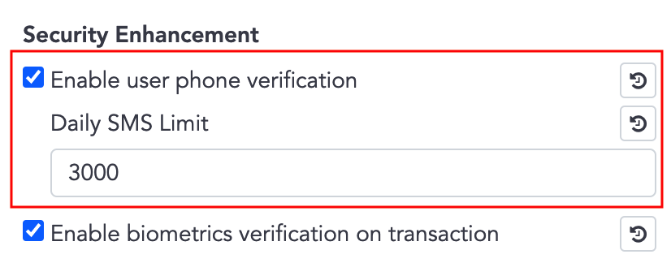
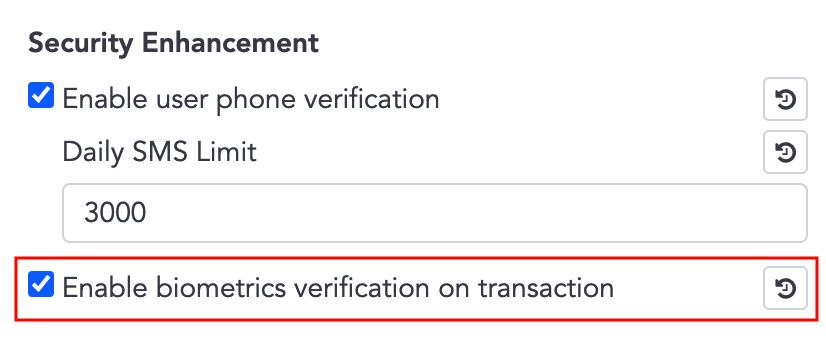

# Security Enhancement
- Security Enhancement is optional, after activated, WalletSDK will require further authentication while signin and transaction / sign operation.
- Bookmarks
  - [Enable User Phone Verification](#enable-user-phone-verification)
  - [Skipping SMS Verify](#skipping-sms-verify)
  - [Enable Biometrics Verification on Transaction](#enable-biometrics-verification-on-transaction)
  - [APIs which Required Biometrics Verification](#apis-which-required-biometrics-verification)

## Enable User Phone Verification
- On the **admin panel** ➜ **System settings** ➜ **Security Enhancement**, you can activate **Enable user phone verification** which means require phone verification when user sign-in on a new device.

     
### SignInState for Register flow
1. Activated this option on the admin panel.
2. App invoke Wallets API, ex. Wallets.getCurrencies(),  `SignInStateListener.onSignInStateChanged()` might be invoked with `NEED_REGISTER_PHONE` or `NEED_VERIFY_OTP`.
```java
Auth.getInstance().addSignInStateListener(new SignInStateListener() {
            @Override
            public void onSignInStateChanged(SignInState signInState) {
                switch (signInState) {
                    case NEED_REGISTER_PHONE:
                        // Lead user to the register phone page
                        break;
                    case NEED_VERIFY_OTP:
                        // Lead user to the verify OTP page
                        break;
                }
            }
        });
```
#### Register Phone - NEED_REGISTER_PHONE 
3. Receiving `NEED_REGISTER_PHONE` means the user hasn't registered a phone number, leading the user to the register phone page.
4. Invoke `registerPhoneNumber()` to send SMS and get `actionToken`.  
  In the case which need resend SMS, ex. SMS expired, just invoke `registerPhoneNumber()` again.
5. Invoke `verifyOtp()` with user input OTP and `actionToken`.
6. Wallets API can be invoked normally now, you can bring the user back to the main page.
```java
// Step 4.
Auth.getInstance().registerPhoneNumber(
        countryCode, //ex."+886"
        phone, // ex."902345678"
        SMS_COOL_TIME_SEC,// SMS expire duration in second, minimum value is 60, ex. 60
        new Callback<RegisterPhoneNumberResult>() {
            @Override
            public void onError(Throwable error) {
                error.printStackTrace();
            }

            @Override
            public void onResult(RegisterPhoneNumberResult result) {
                // Keep result.actionToken for verifyOtp()
            }
});
// Step 5.
Auth.getInstance().verifyOtp(
                actionToken,// From result of registerPhoneNumber()
                smsCode, // Input by user
                new Callback<VerifyOtpResult>() {
                    @Override
                    public void onError(Throwable error) {
                        error.printStackTrace();
                    }

                    @Override
                    public void onResult(VerifyOtpResult result) {
                        //Step 6. Bring user back to the main page
                    }
                });
```
#### Verify OTP while Signing on New Device - NEED_VERIFY_OTP
3. Receiving `NEED_VERIFY_OTP` means the user has registered the phone, but signed in on a new device, leading the user to the verify OTP page.
4. Invoke `getLoginSmsCode()` to send SMS and get `actionToken`.  
  In the case which need resend SMS, ex. SMS expired, just invoke `getLoginSmsCode()` again.
5. Invoke `verifyOtp()` with user input OTP and `actionToken`.
6. Wallets API can be invoked normally now, you can bring the user back to the main page.
```java
// Step 4.
        Wallets.getInstance().getLoginSmsCode(
                SMS_COOL_TIME_SEC, // SMS expire duration in second, minimum value is 60, ex. 60
                new Callback<GetActionTokenResult>() {
                    @Override
                    public void onError(Throwable error) {
                        error.printStackTrace();
                    }
        
                    @Override
                    public void onResult(GetActionTokenResult result) {
                        // Keep result.actionToken for verifyOtp()
                    }
        });
// Step 5.
Auth.getInstance().verifyOtp(
                actionToken,// From result of registerPhoneNumber()
                smsCode, // Input by user
                new Callback<VerifyOtpResult>() {
                    @Override
                    public void onError(Throwable error) {
                        error.printStackTrace();
                    }

                    @Override
                    public void onResult(VerifyOtpResult result) {
                        //Step 6. Bring user back to the main page
                    }
                });        
```

## Skipping SMS Verify

- Although `Security Enhancement` is applied globally, in User Management, the administrator still can set a single user to skip SMS / biometrics verification.


   
- By checking `UserState`, you can get to know whether the user is required verify or not.
  -  `enableBiometrics`  
      Mapping to **admin panel** ➜ **System settings** ➜ **Security Enhancement** ➜ **Enable biometrics verification on transaction**
  -  `skipSmsVerify`  
      Mapping to **admin panel** ➜ **User Management** ➜ click signal user ➜ **Skip SMS verification**
  -  `accountSkipSmsVerify`  
      Not configuable

    ```java
    public final class UserState {

        public boolean enableBiometrics; // Is enable biometric authentication

        public boolean skipSmsVerify; // Is skip SMS/Biometrics verify

        public boolean accountSkipSmsVerify; // Is skip SMS for specific case, ex. Apple account

        ...
    }
    ```

- `if (enableBiometrics && !skipSmsVerify)` ➜ need biometrics / SMS verification for transaction and sign operation

- `if (accountSkipSmsVerify == true)` ➜ cannot use SMS for verification, use biometrics verification instead.

    ex. For Apple Sign-In account,  only biometrics verification is available.
## Enable Biometrics Verification on Transaction
- On the **admin panel** ➜ **System settings** ➜ **Security Enhancement**, you can activate **Enable biometrics verification on transaction** which means require biometrics verification (or SMS verification if the device does not support biometrics) while performing transaction or sign operations, related APIs are list in [APIs which Required Biometrics Verification](#apis-which-required-biometrics-verification).
- If **Enable biometrics verification on transaction** is activated, the system will also activate **Enable user phone verification**.

     
### Setup for Biometrics Verification


- Complete the setup before using [APIs which Required Biometrics Verification](#apis-which-required-biometrics-verification).
- Steps:
    1. Check if the user needs biometrics / SMS verification
    2. Call `updateDeviceInfo`, pass nil Wallet SDK will decide the value for you.
        - This step is telling server if the device able to use biometrics or not.
        - Passing `BiometricsType.NONE` means you'll use SMS verification instead of biometrics.
    3. Call `getBiometricsType` ➜ supported biometric type
    4. `if (BiometryType != BiometricsType.NONE)` ➜ call `registerPubkey`
    5. `if (BiometryType == BiometricsType.NONE)` && `accountSkipSmsVerify` ➜ prompt error. ex. The device not supporting biometrics, please contact the system admin.  
    (There's no Apple Sign-In account on Android, ignore this)
```java
    public void checkAndRegisterPubkey(){
        // Step 3.
        BiometricsType type = Wallets.getInstance().getBiometricsType(mApp);// BiometryType { NONE / FACE / FINGER }
        // Step 2., update device's biometrics type
        Wallets.getInstance().updateDeviceInfo(type.ordinal(), new Callback<UpdateDeviceInfoResult>() {
            @Override
            public void onError(Throwable error) {
                error.printStackTrace();
                registerPubKey(type);
            }

            @Override
            public void onResult(UpdateDeviceInfoResult updateDeviceInfoResult) {
                registerPubKey(type);
            }
        });
    }

    // Step 4.
    public void registerPubKey(BiometricsType type){
        if (type == BiometricsType.NONE){
            return;
        }
        //Register public key for biometrics authentication
        Wallets.getInstance().registerPubkey(new Callback<RegisterPubkeyResult>() {
            @Override
            public void onError(Throwable error) {
                error.printStackTrace();
            }

            @Override
            public void onResult(RegisterPubkeyResult registerPubkeyResult) {
                mRegisteredPubKyc.setValue(true);
            }
        });
    }
```
## APIs which Required Biometrics Verification 

- There are two versions (biometrics and SMS) for following transaction  / sign APIs:
  - createTransaction
  - requestSecureToken
  - signRawTx
  - increaseTransactionFee
  - callAbiFunction
  - cancelTransaction
  - callAbiFunctionTransaction
  - signMessage
  - walletConnectSignTypedData
  - walletConnectSignTransaction
  - walletConnectSignMessage
  - cancelWalletConnectTransaction
  - commonSignRawTx
  - setSolTokenAccountTransaction

- SMS version has the suffix 'Sms', ex. createTransactionSms
- Biometrics version has the suffix 'Bio', ex. createTransactionBio

### SMS version usage
1. Invoke `getTransactionSmsCode()` to send SMS and get `actionToken`.
2. Invoke SMS version function with user input OTP, `actionToken`. Other parameters are same as usual.
```java
// Step 1.
Wallets.getInstance().getTransactionSmsCode(
            SMS_COOL_TIME_SEC, // SMS expire duration in second, minimum value is 60, ex. 60
            new Callback<GetActionTokenResult>() {
                @Override
                public void onError(Throwable error) {
                    error.printStackTrace();
                }
    
                @Override
                public void onResult(GetActionTokenResult result) {
                    // Keep result.actionToken for next step. ex. calling createTransactionSms()
                }
    });
// Step 2.  
Wallets.getInstance().createTransactionSms(
                actionToken, // From result of registerPhoneNumber()
                smsCode, // Input by user
                fromWalletId, toAddress, amount, transactionFee, description, pinSecret, extras, callback);
```

### Biometrics version usage
1. Invoke biometrics version funtion with `activity`, `promptMessage`, `cancelButtonText`. Other parameters are same as usual.
```java
Wallets.getInstance().createTransactionBio(
                getActivity(),
                promptMessage, // ex. "Authorize transactions with biometrics"
                cancelButtonText, // ex. "Cancel"
                fromWalletId, toAddress, amount, transactionFee, description, pinSecret, extras, callback);
```