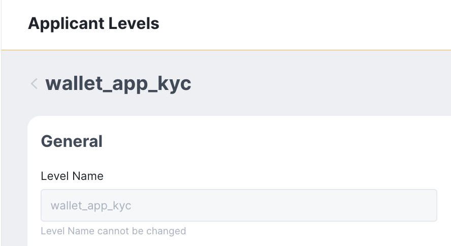
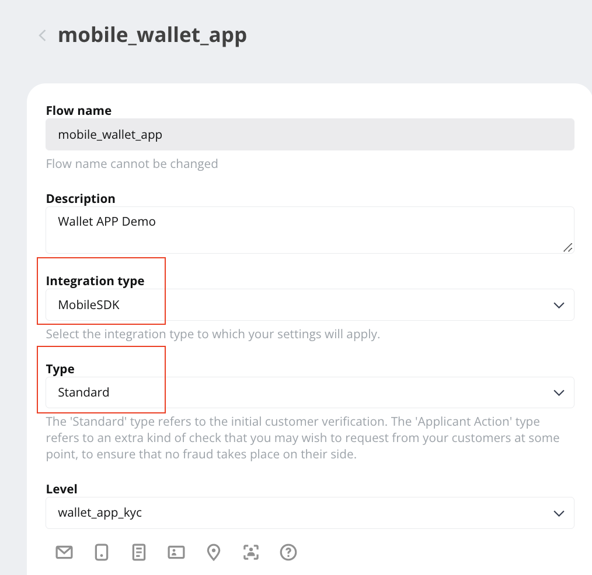

# KYC with Sumsub

> For KYC requirement, Wallet SDK has integrated with [Sumsub](https://sumsub.com/) and provides corresponding API for launching [Sumsub MSDK](https://developers.sumsub.com/msdk/#getting-started) and sharing data.


- Bookmark:
  - [Preparation](#preparation)
  - [Create an Applicant](#create-an-applicant)
  - [Access Token and Launching Sumsub MSDK](#access-token-and-launching-sumsub-msdk)
  - [Sharing Applicants between Partner Services](#sharing-applicants-between-partner-services)
  - [Getting applicant status](#getting-applicant-status)

## Preparation

1. Wallet SDK has implemented some of tasks in [MSDK's backend routines](https://developers.sumsub.com/msdk/#backend-routines) for  you. Please go to the **admin panel** ➜ navigate to **App settings** ➜ add below configurations for the target App:  
    - Sumsub Server URL: can be `https://api.sumsub.com`. For more detail, please see [this](https://developers.sumsub.com/api-reference/#introduction). 
    - Sumsub Token: generate on [Sumsub dashboard](https://cockpit.sumsub.com/checkus?_gl=1*1qzwmb0*_ga*MTY0OTA2OTIzNy4xNjQ2NjM2ODE4*_ga_ZF910PGWRL*MTY1MjE4MzU0OC44MS4xLjE2NTIxODkyMzIuNTI.#/devSpace/appTokens). For more detail, please see [this](https://developers.sumsub.com/api-reference/#app-tokens).
    - Sumsub Secret: as above, **_Sumsub Token_**.
    - Sumsub Level Name: [set up your applicant level](https://api.sumsub.com/checkus?_gl=1*15coo51*_ga*MTY0OTA2OTIzNy4xNjQ2NjM2ODE4*_ga_ZF910PGWRL*MTY1MjE4MzU0OC44MS4xLjE2NTIxOTAzMzUuNjA.#/sdkIntegrations/levels) and fill the name here.  

        
    - Sumsub Access Token TTL: time to live for the token, in second.
    - Sumsub Flow Name: [set up your applicant flow](https://api.sumsub.com/checkus?_gl=1*1ccutv*_ga*MTY0OTA2OTIzNy4xNjQ2NjM2ODE4*_ga_ZF910PGWRL*MTY1MjE4MzU0OC44MS4xLjE2NTIxOTA4ODEuNjA.#/sdkIntegrations/flows) and fill the name here.  
⚠️ Please note that must select `MobileSDK` for "Integration type" and select `Standard` for "Type"

        
    * You can use `Auth.getInstance().checkKycSetting()` to check if `Sumsub Server URL`, `Sumsub Token` and `Sumsub Secret` are set properly and display / hide related UI.

        ```java
        ///
        /// Check if KYC setting is exist:
        ///                <ul>
        ///                 <li>Sumsub server URL</li>
        ///                 <li>Sumsub Token</li>
        ///                 <li>Sumsub Secret</li>
        ///               </ul>
        ///  @param Callback<CheckKycSettingResult>
        ///     onResult: result 1: setting exist, 0: setting not exist
        ///     onError: handle ApiError
        ///
        public abstract void checkKycSetting(Callback<CheckKycSettingResult> callback);
        ```
3. [Sumsub MSDK installation](https://developers.sumsub.com/msdk/android/#installation)    
    ⚠️ Version `1.19.4` or later is recommended.

    Make below modify in your `android/build.gradle` file:

    ```gradle
    buildscript {
        dependencies {
            //...
            // use version 4.0.1 or later for 1.19.4
            classpath('com.android.tools.build:gradle:4.0.1') 
        }
    }
    ```
    Make below modify in your `app/build.gradle` file:
    ```gradle
    repositories {
        mavenCentral()
        maven { url 'https://jitpack.io' }
        maven { url "https://maven.sumsub.com/repository/maven-public/" }
    }

    dependencies {
        // SumSub core
        implementation "com.sumsub.sns:idensic-mobile-sdk:$latestVersion"
    }
    ```
    Check the version in your `gradle-wrapper.properties` file:  

    ```properties
    # use gradle-6.1.1-all or later for 1.19.4
    distributionUrl=https\://services.gradle.org/distributions/gradle-6.1.1-all.zip
    ```
## Create an Applicant
- Use `Auth.getInstance().createKyc()` to create an applicant on Sumsub for the current user.
- Wallet SDK will use the user's `Unique token` as `External user ID`, therefore you can utilize those to mapping.
- Please note that an applicant will be created with `Sumsub Level Name` (see [this](https://developers.sumsub.com/api-reference/#creating-an-applicant)), if change `Sumsub Flow Name` to others which belongs to a different level name, launch MSDK may fail.
- In Sumsub sandbox environment, it seems that applicants being deleted is possible, which also will cause launch MSDK failed.

    ```java
    ///
    /// Create KYC Applicant
    ///
    /// @param country ISO alpha-3 code of applicant
    /// - https://en.wikipedia.org/wiki/ISO_3166-1_alpha-3
    /// 
    /// @param callback Callback<CreateKycResult>
    ///
    public abstract void createKyc(String country, Callback<CreateKycResult> callback);
    ```
## Access Token and Launching Sumsub MSDK
- Use `Auth.getInstance().getKycAccessToken()` and use the result to launch MSDK
- User must has called `createKyc` before this step, which means have an applicant on Sumsub dashboard.
- Please visit [Sumsub Developer Hub](https://developers.sumsub.com/msdk/android/#initialization) for detailed MSDK instruction .

    ```java
    import com.sumsub.sns.core.SNSMobileSDK;
    import com.sumsub.sns.core.data.listener.TokenExpirationHandler;

    Auth.getInstance().getKycAccessToken(new Callback<GetKycAccessTokenResult>() {
            @Override
            public void onError(Throwable error) {
                error.printStackTrace();
            }

            @Override
            public void onResult(GetKycAccessTokenResult result) {
                launchSnsSDK(result.token);
            }
    });
    
    private void launchSnsSDK(String accessToken){
        TokenExpirationHandler tokenUpdater = () -> {
            // Access token expired
            // get a new one and pass it to the callback to re-initiate the SDK
            try{
                GetKycAccessTokenResult result = Auth.getInstance().getKycAccessTokenSync(); 
                return result.token;
            }catch (Throwable error){
                error.printStackTrace();
                return "";
            }
        };

        try{
            SNSMobileSDK.SDK snsSdk = new SNSMobileSDK.Builder(requireActivity())
                    .withAccessToken(accessToken, tokenUpdater)
                    .withLocale(new Locale("en"))
                    .withDebug(true)
                    .build();
            snsSdk.launch();
        }catch (Throwable error){
            error.printStackTrace();
        }
    }
    ```
## Sharing Applicants between Partner Services
- Sumsub also provides sharing which allows different services share applicant's KYC data via `share token`. Please visit their [API Reference](https://developers.sumsub.com/api-reference/#sharing-applicants-between-partner-services) for detailed introduction and instructions for `share token` use. 
- Use `Auth.getInstance().getKycShareToken()` to get `share token` for the current user.

    ```java
    ///
    /// Get user's share token for KYC
    /// 
    /// @param callback Callback<GetKycShareTokenResult>
    ///
    public abstract void getKycShareToken(Callback<GetKycShareTokenResult> callback);
    ```
## Getting applicant status
- Sumsub provides API to get applicant status, for detailed status definition, please visit their [API Reference](https://developers.sumsub.com/api-reference/#getting-applicant-status-sdk).
- Use `Auth.getInstance().getApplicantStatus()` to get applicant status.

    ```java
    ///
    /// Get applicant KYC status for current user
    /// The response is based on Sumsub API's definition, see
    /// https://developers.sumsub.com/api-reference/#getting-applicant-status-sdk
    ///
    /// @param callback Asynchronized callback
    public abstract void getApplicantStatus(Callback<GetApplicantStatusResult> callback) ;
    ```