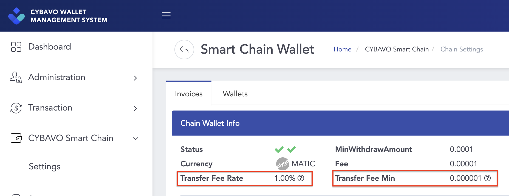
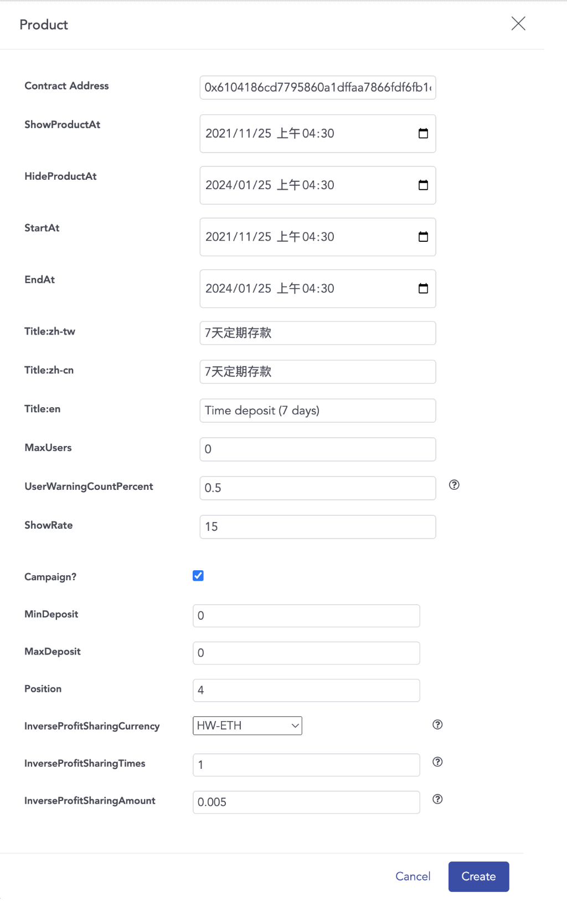
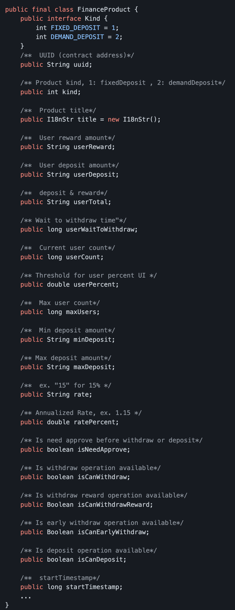
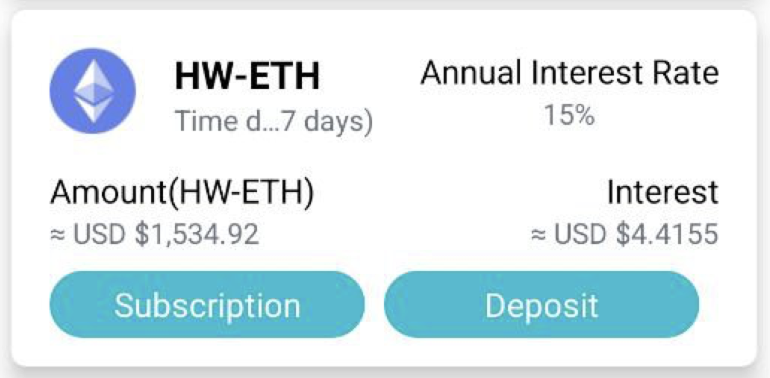

# CYBAVO Private Chain (CPC)

- Scenario for:
  - Financial Products
  - Financial Management Services
  
- Advantages of a private chain:
    1. Free; zero transaction fee for inner transfer
    2. Faster; faster than public chain
    3. Community; referral system is possible

- Easy to implement, sharing APIs with the public chain.

- Bookmarks
  - [Model - Wallet](#wallet)
  - [Model - Currency](#currency)
  - [Model - UserState](#userstate)
  - [Transactions - Deposit to Private Chain](#1-deposit-to-private-chain)
  - [Transactions - Withdraw to Public Chain](#2-withdraw-to-public-chain)
  - [Transactions - Inner Transfer](#3-inner-transfer)
  - [Transaction History](#transaction-history)
  - [Finance Product](#finance-product-solution)

## Models

### Wallet

```java
public final class Wallet {

    public long walletId; // Wallet ID

    public boolean isPrivate; // Is private chain (CPC)

    public long mapToPublicCurrency; // Public chain's currency

    public String mapToPublicTokenAddress; // Public chain's tokenAddress

    public String mapToPublicName; // Public chain's currency_name

    public String walletCode; // Address(referral code) for transaction in private chain

    public DepositAddress[] depositAddresses; // Deposit info, public chain to private chain

    public boolean isPrivateDisabled; // Is disabled private currency
    
    ...
}
```

- `isPrivate` means the wallet is on the private chain
- Thus, it will map to a public currency on the public chain.  
  - related infos: `mapToPublicCurrency`, `mapToPublicTokenAddress`, `mapToPublicName`
- `depositAddresses` provides the addresses on the public chain. When you deposit currencies / tokens to these addresses, you will receive tokens in the related private chain wallet.
  - multiple `depositAddresses` means one private chain wallet might provide multiple addresses for depositing.
  - ex: CPSC-USDT on private chain is mapped to USDT-ERC20 and USDT-TRC20 on the public chains, so you will get multiple addresses in this field.
  - `memo` in model `DepositAddress` is necessary when depositing tokens from public chain to private chain.

### Currency

```java
public final class Currency {

    final public boolean isPrivate; // Is private chain (CPC)

    final public long mapToPublicType; // Public chain's currency type

    final public String mapToPublicTokenAddress; // Public chain's token address

    final public String mapToPublicName; // Public chain's currency name

    final public boolean canCreateFinanceWallet; // Can create finance wallet

    ...
}
```

- `isPrivate` means the currency is on the private chain
- Thus, it will map to a public currency on the public chain.  
  - related infos: `mapToPublicType`, `mapToPublicTokenAddress`, `mapToPublicName`, `canCreateFinanceWallet`

- How to create a private chain wallet with the currency?
  - Basically, it's the same way as we mentioned in [createWallet](wallets.md#createwallet), the only difference is the filtering condition of currency and wallet.
  - In the chart below, `Available Currencies` should be `isPrivate == true && (canCreateFinanceWallet == true || TextUtils.isEmpty(tokenAddress))`
  

### UserState

```java
public final class UserState {

    public String userReferralCode; // User referral code

    public String linkUserReferralCode; // Link user referral code (referral by this code, only one per user)

    ...
}
```

- Referral Code has two use cases:
    1. referral system
    2. substitute readable address for making transactions in the private chain
- `userReferralCode` represent the user's referral code
- `linkUserReferralCode` represent the referrer's referral code
- Call `Auth.getInstance().registerReferralCode()` to register a referrer.
- You can search user by calling `Auth.getInstance().searchUser()`, the keyword can be `realName` (partial match) or `referralCode` (fully match)
  ```java
  Auth.getInstance().searchUser("userX", new Callback<SearchUserResult>() {
                @Override
                public void onError(Throwable error) {
                    //keyword length cannot less then 3, 
                    //otherwise the API will receive ErrKeywordForSearchTooShort
                    error.printStackTrace();
                }

                @Override
                public void onResult(SearchUserResult result) {
                    for(int i = 0; i < result.infos.length; i++){
                        Log.d("searchUser", String.format("#%d, Name: %s, Code: %s", 
                              i, result.infos[i].realName, result.infos[i].referralCode));
                    }
                }
            });

  ```
- You can update `realName` by calling `Auth.getInstance().updateRealName()`
  ```java
  Auth.getInstance().updateRealName("userY" , new Callback<UpdateRealNameResult>() {
                @Override
                public void onError(Throwable error) {
                    //realName length cannot less then 3, 
                    // otherwise the API will receive ErrKeywordForSearchTooShort
                    error.printStackTrace();
                }

                @Override
                public void onResult(UpdateRealNameResult result) {
                    //getUserState after updateRealName
                    Auth.getInstance().getUserState(new Callback<GetUserStateResult>() {
                        @Override
                        public void onError(Throwable error) {
                            error.printStackTrace();
                        }

                        @Override
                        public void onResult(GetUserStateResult result) {
                            Log.d("updateRealName",String.format("newRealName: %s", result.userState.realName));
                        }
                    });
                }
            });
  ```
## Transactions

- There are 3 types of transactions on the private chain.

### 1. Deposit to Private Chain

- Select a private wallet, create a new one if needed.
- Select a deposit address of the private wallet.
- Present the address and memo of the deposit address for deposit.

### 2. Withdraw to Public Chain

#### Get Transaction Fee

- Withdrawing to public chain will be charged a fixed transaction fee.  
i.e. `getTransactionFee()` will return the same amount of { high, medium, low } level for private chain currency.
- Use `wallet.depositAddress` 's `Currency` and `tokenAddress` as parameters to get the transaction fee for withdraw to public chain.
- The { receive amount = transfer amount - transaction fee }
- The receive amount cannot less than `withdrawMin`

```java
public final  class GetTransactionFeeResult {
    
    public String withdrawMin; // Minimum transfer amount for private
    
    ...
}
```

#### Perform Withdraw

- Call `callAbiFunctionTransaction()` to perform the transaction with specific parameters:

```java
DepositAddress depositAddress = wallet.depositAddress[0] //select a deposit address
Object[] args = new Object[]{toAddress,
                   transferAmount, //ex. "123.123456"
                   memo, // optional, ex. "123456" 
                   Long.toString(depositAddress.mapToPublicCurrency), //ex. "60"
                   depositAddress.mapToPublicTokenAddress}; 

Wallets.getInstance().callAbiFunctionTransaction(walletId, 
                    "burn", // name: fixed to "burn"
                    wallet.tokenAddress, 
                    "", // abiJson: fixed to ""
                    args, 
                    "0", //transactionFee: our backend will take care of this 
                    pinSecret, callback);
```

### 3. Inner Transfer

#### Private Chain Platform Fee
- On the **admin panel** ➜ **CYBAVO Smart Chain** ➜ **Chain Settings**, choose a currency which supports platform fee, click **Manage** button ➜ **Chain Wallet info**, you can found **Transfer Fee Rate** and **Transfer Fee Min**.  

  
- All the transfer operation on private chain will be charged platform fee, including inner transfer and transaction for finance product, not including deposit to private chain and withdraw to public chain. 
- Platform fee calculation:
  1. Platform Fee = Transfer Amount * **Transfer Fee Rate**
  2. If the result of step 1 is less then **Transfer Fee Min**, use **Transfer Fee Min**.
  3. If the currency not supported platform fee, the `platformFee` will be "0".
- You can use `estimateTransaction()` to get the platfom fee:
```java
Wallets.getInstance().estimateTransaction(
                wallet.currency,
                wallet.tokenAddress,
                amount,// ex. "100"
                "0", // transactionFee: fixed to "0"
                wallet.walletId,
                new Callback<EstimateTransactionResult>() {
                    @Override
                    public void onError(Throwable error) {
                        error.printStackTrace();
                    }
        
                    @Override
                    public void onResult(EstimateTransactionResult result) {
                        //check result.platformFee
                    }
        });
```
#### Create Transaction
- Call `createTransaction()` to perform the transaction with specific parameters:

```java
final Map<String, Object> extras = new HashMap<>();
extras.put("kind", "code"); //means it's a inner transfer transaction

Wallets.getInstance().createTransaction(walletId,
                    toAddress, //other user's userReferralCode, ex. "8X372G"
                    transferAmount, //ex. "123.123456"
                    "0", // transactionFee: fixed to "0"
                    description,
                    pinSecret,
                    extras, callback);
```

## Transaction History

- Basically, it's the same way as we mentioned in [transaction.md](transaction.md).  
 The only different thing is the parameter `crosschain` of `getHistory()`:
  - Pass `crosschain: 1`, it returns transactions of [Deposit to Private Chain](#deposit-to-private-chain) and [Withdraw to Public Chain](#withdraw-to-public-chain)
  - Pass `crosschain: 0`, it returns transactions of [Inner Transfer](#inner-transfer).

## Finance Product Solution
After deposit to CPC, you can further deposit to finance product for a period of time to get interest, the finance product can be setup on the admin panel.  
In this section, we will illustrate how to achieve this feature through related API.

### Product Setting and Model
Below is an example to show how a finance product may look like and related fields. 

|  Product Setting (Admin Panel)   | Model  | Example UI (App)  |
|  ----  | ----  | ----  |
|    |  |   |
|  Contract Address  | `uuid`  | |
|  StartAt  | `startTimestamp`  | If current time is earlier than `startTimestamp`, display **Not Start** tag|
|  Title:zh-tw <br>Title:zh-cn<br>Title:zh-en | `title.tw`<br>`title.cn`<br>`title.en`  | Display one of these as product name according to device locale|
|  Max Users<br>UserWarningCountPrcent  | `maxUsers`<br>`userPercent`  | If `maxUsers` <= `userCount`, display **Sold Out** tag<br>If `maxUsers` * `userPercent` >= `userCount`, display **Available** tag, else  display **About Full** tag|
|  Show Rate  | `rate`  | Display it as annual interest rate, use `ratePercent` for calculation|
|  Campaign  | `GetFinanceProductsResult.campaign`  | If Campaign is checked, this product will also exist in `GetFinanceProductsResult.campaig`|
|  MinDeposit<br>MaxDeposit  | `minDeposit`<br>`maxDeposit`  | Display the deposit amount limit range, ex.  **Min 0.1 HW-ETH - 1000 HW-ETH** |
|  InverseProfitSharingCurrency  | `kind`  | There are 2 types of finance product: fixed deposit and demand deposit<br>If InverseProfitSharingCurrency is set to **Disable**, `kind` is `FinanceProduct.Kind.DEMAND_DEPOSIT` = `2` ,<br>otherwise, `kind` is `FinanceProduct.Kind.FIXED_DEPOSIT` = `1`.
|
 

