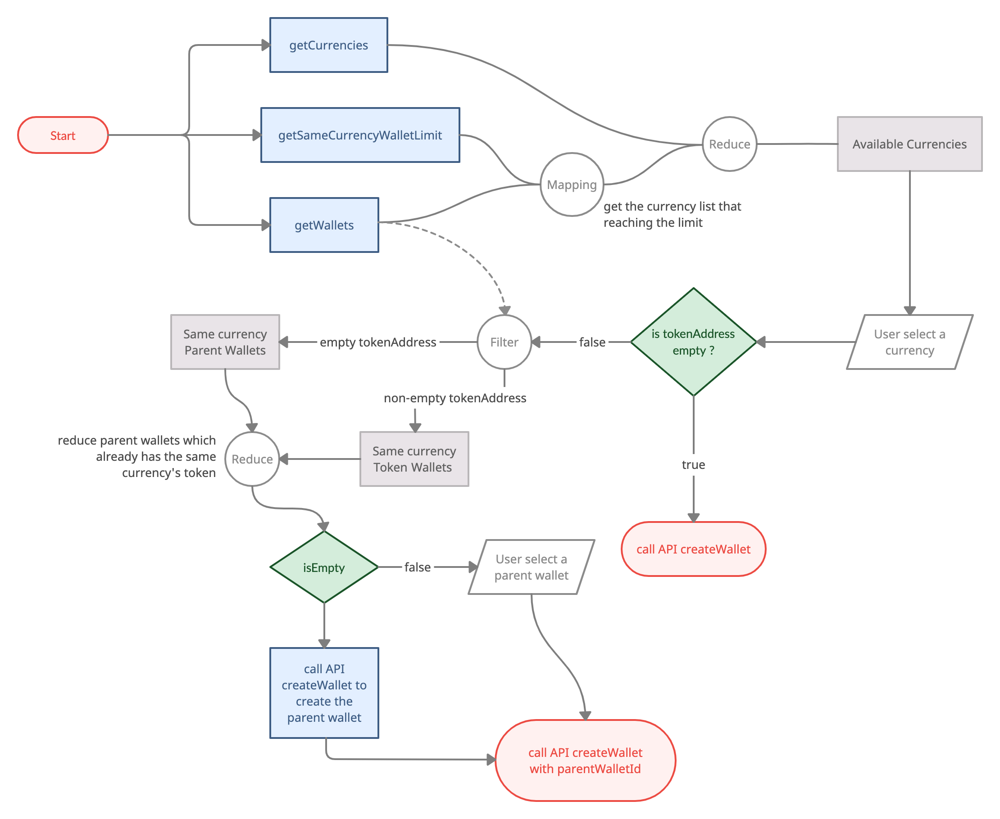

# Private Chain

- Private chain a.k.a. CYBAVO Private Smart Chain (CPSC)
- Scenario for:
  - Financial Products
  - Financial Management Services
  
- Advantages of a private chain:
    1. Free; zero transaction fee for inner transfer
    2. Faster; faster than public chain
    3. Community; referral system is possible

- Easy to implement, sharing APIs with the public chain.

- Bookmarks
  - [Model - Wallet](#wallet)
  - [Model - Currency](#currency)
  - [Model - UserState](#userstate)
  - [Transactions (Deposit to Private Chain, Withdraw to Public Chain, Inner Transfer)](#transactions)
  - [Transaction History](#transaction-history)

## Models

### Wallet

```java
public final class Wallet {

    public long walletId; // Wallet ID

    public boolean isPrivate; // Is private chain (CPSC)

    public long mapToPublicCurrency; // Public chain's currency

    public String mapToPublicTokenAddress; // Public chain's tokenAddress

    public String mapToPublicName; // Public chain's currency_name

    public String walletCode; // Address(referral code) for transaction in private chain

    public DepositAddress[] depositAddresses; // Deposit info, public chain to private chain

    public boolean isPrivateDisabled; // Is disabled private currency
    
    ...
}
```

- `isPrivate` means the wallet is on the private chain
- Thus, it will map to a public currency on the public chain.  
  - related infos: `mapToPublicCurrency`, `mapToPublicTokenAddress`, `mapToPublicName`
- `depositAddresses` provides the addresses on the public chain. When you deposit currencies / tokens to these addresses, you will receive tokens in the related private chain wallet.
  - multiple `depositAddresses` means one private chain wallet might provide multiple addresses for depositing.
  - ex: CPSC-USDT on private chain is mapped to USDT-ERC20 and USDT-TRC20 on the public chains, so you will get multiple addresses in this field.
  - `memo` in model `DepositAddress` is necessary when depositing tokens from public chain to private chain.

### Currency

```java
public final class Currency {

    final public boolean isPrivate; // Is private chain (CPSC)

    final public long mapToPublicType; // Public chain's currency type

    final public String mapToPublicTokenAddress; // Public chain's token address

    final public String mapToPublicName; // Public chain's currency name

    final public boolean canCreateFinanceWallet; // Can create finance wallet

    ...
}
```

- `isPrivate` means the currency is on the private chain
- Thus, it will map to a public currency on the public chain.  
  - related infos: `mapToPublicType`, `mapToPublicTokenAddress`, `mapToPublicName`, `canCreateFinanceWallet`

- How to create a private chain wallet with the currency?
  - Basically, it's the same way as we mentioned in [createWallet](wallets.md#createwallet), the only difference is the filtering condition of currency and wallet.
  - In the chart below, `Available Currencies` should be `isPrivate == true && (canCreateFinanceWallet == true || TextUtils.isEmpty(tokenAddress))`
  

### UserState

```java
public final class UserState {

    public String userReferralCode; // User referral code

    public String linkUserReferralCode; // Link user referral code (referral by this code, only one per user)

    ...
}
```

- Referral Code has two use cases:
    1. referral system
    2. substitute readable address for making transactions in the private chain
- `userReferralCode` represent the user's referral code
- `linkUserReferralCode` represent the referrer's referral code
- call `Auth.getInstance().registerReferralCode()` to register a referrer.

## Transactions

- There are 3 types of transactions on the private chain.

### 1. Deposit to Private Chain

- Select a private wallet, create a new one if needed.
- Select a deposit address of the private wallet.
- Present the address and memo of the deposit address for deposit.

### 2. Withdraw to Public Chain

#### getTransactionFee

- Withdrawing to public chain will be charged a fixed transaction fee.  
i.e. `getTransactionFee()` will return the same amount of { high, medium, low } level for private chain currency.
- Use `wallet.depositAddress` 's `Currency` and `tokenAddress` as parameters to get the transaction fee for withdraw to public chain.
- The { receive amount = transfer amount - transaction fee }
- The receive amount cannot less than `withdrawMin`

```java
public final  class GetTransactionFeeResult {
    
    public String withdrawMin; // Minimum transfer amount for private
    
    ...
}
```

#### Perform Withdraw

- Call `callAbiFunctionTransaction()` to perform the transaction with specific parameters:

```java
DepositAddress depositAddress = wallet.depositAddress[0] //select a deposit address
Object[] args = new Object[]{toAddress,
                   transferAmount, //ex. "123.123456"
                   memo, // optional, ex. "123456" 
                   Long.toString(depositAddress.mapToPublicCurrency), //ex. "60"
                   depositAddress.mapToPublicTokenAddress}; 

Wallets.getInstance().callAbiFunctionTransaction(walletId, 
                    "burn", // name: fixed to "burn"
                    wallet.tokenAddress, 
                    null, // abiJson: fixed to null
                    args, 
                    "0", //transactionFee: our backend will take care of this 
                    pinSecret: pinSecret, callback);
```

### 3. Inner Transfer

- There's no transaction fee for inner transfer.
- Call `createTransaction()` to perform the transaction with specific parameters:

```java
final Map<String, Object> extras = new HashMap<>();
extras.put("kind", "code"); //means it's a inner transfer transaction

Wallets.getInstance().createTransaction(walletId,
                    toAddress, //other user's userReferralCode, ex. "8X372G"
                    transferAmount, //ex. "123.123456"
                    "0", // transactionFee: fixed to "0"
                    description,
                    pinSecret,
                    extras, callback);
```

## Transaction History

- Basically, it's the same way as we mentioned in [transaction.md](transaction.md).  
 The only different thing is the parameter `crosschain` of `getHistory()`:
  - Pass `crosschain: 1`, it returns transactions of [Deposit to Private Chain](#deposit-to-private-chain) and [Withdraw to Public Chain](#withdraw-to-public-chain)
  - Pass `crosschain: 0`, it returns transactions of [Inner Transfer](#inner-transfer).
