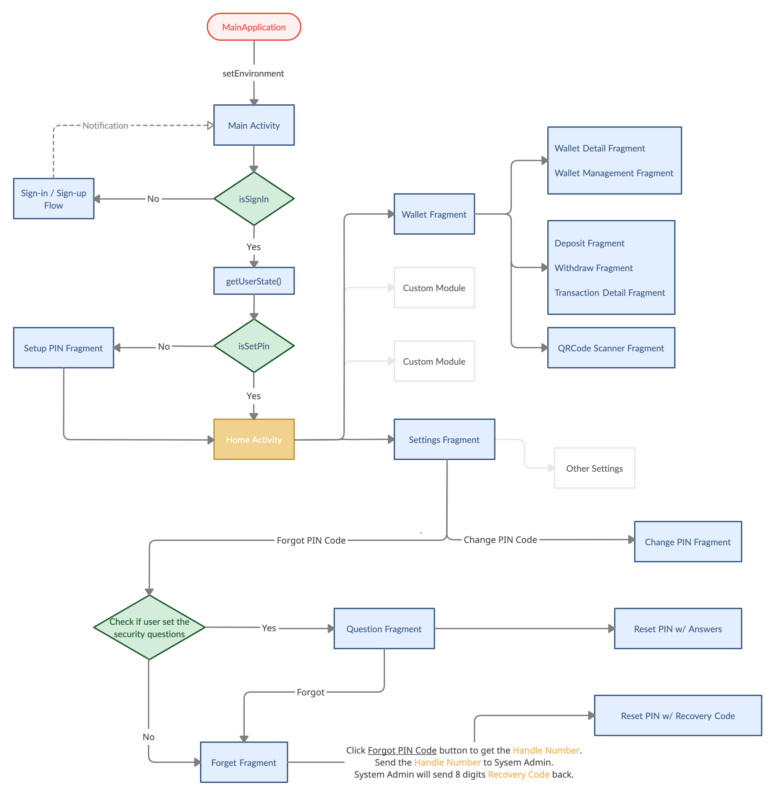
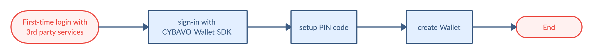
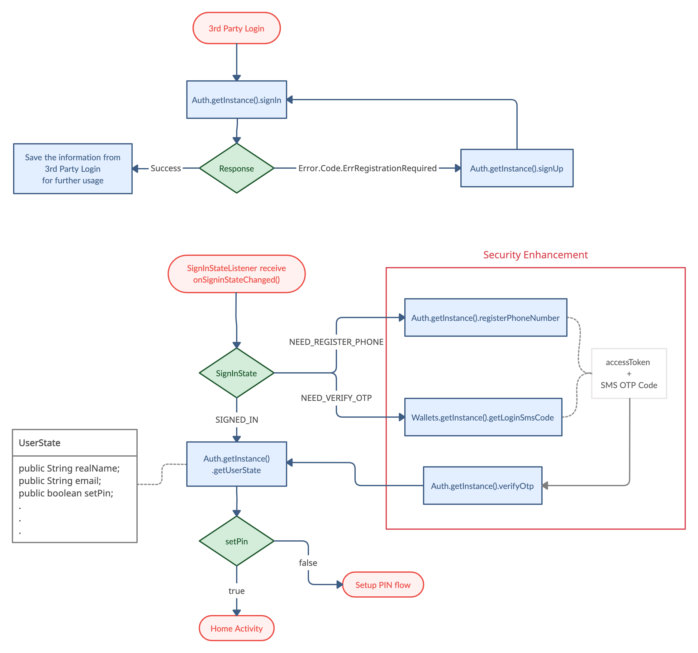

# CYBAVO Wallet APP SDK (for Andorid) - Guideline

> Welcome to CYBAVO Wallet APP SDK (for Android) - Guideline

The **CYBAVO Wallet APP SDK** provides a thorough solution for building Institutional-grade security wallets.  
It provides both high-level and low-level APIs for nearly all **CYBAVO Wallet APP** features, backed by **CYBAVO** private key protection technology.

- Category
  - [SDK Guideline](#sdk-guideline)
  - [Auth](#auth)
  - [PIN Code](#pin-code)
  - Wallets ➜ [wallets.md](wallets.md)
  - Transaction ➜ [transaction.md](transaction.md)
  - Biometrics & SMS ➜ [bio_n_sms.md](bio_n_sms.md)
  - [Push Notification](#push-notification)
  - [Others](#others)
  - Advanced
    - NFT ➜ [NFT.md](NFT.md)
    - WalletConnect ➜ [wallet_connect.md](wallet_connect.md)
    - Private Chain ➜ [private_chain.md](private_chain.md)
    - KYC with Sumsub ➜ [kyc_sumsub.md](kyc_sumsub.md)

## SDK Guideline

### Prerequisite

Please contact **CYBAVO** to get your `endPoint` and `apiCode`.

### Installation

- Add the CYBAVO maven repository to the repositories section in your project level `build.gradle` file: 
    ```gradle
    repositories {
        maven {
            Properties properties = new Properties()
            properties.load(project.rootProject.file('local.properties').newDataInputStream()) // load local.properties

            url properties.getProperty('walletsdk.maven.url')
            credentials {
                username = properties.getProperty('walletsdk.maven.username')
                password = properties.getProperty('walletsdk.maven.password')
            }
        }
    }
    ```
- Add `local.properties` to config Maven repository URL / credentials provided by CYBAVO
   ```properties
   walletsdk.maven.url=$MAVEN_REPO_URL
   walletsdk.maven.username=$MAVEN_REPO_USRENAME
   walletsdk.maven.password=$MAVEN_REPO_PASSWORD
   ```
- Add the following dependencies to your app level `build.gradle` file:
   ```gradle
   dependencies {
      implementation 'com.cybavo.wallet:wallet-sdk-lib:1.2.+'
  }
   ```


### Initialization

- Initialize Wallet SDK before using it.

  ```java
  WalletSdk.init(getApplicationContext(),  new WalletSdk.Configuration(endpoint, apiCode));
  ```

- See this : [Sandbox Environment](#sandbox-environment)

### APP Flowchart



### First-time login tasks



[↑ go to the top ↑](#cybavo-wallet-app-sdk-for-andorid---guideline)

---

# Auth

## Sign-in / Sign-up Flowchart



## Third-Party login

  Supported services : Google / Facebook / LINE / Twitter / WeChat

## Sign-in flow

- 3rd party login ➡️ `Auth.getInstance().signIn` ➡️ get success ➡️ wait for `onSignInStateChanged` update
  
- 3rd party login ➡️ `Auth.getInstance().signIn` ➡️ get `Error.Code.ErrRegistrationRequired` ➡️ Sign-up flow

```java
/// Sign in with Wallet SDK Auth 
///
/// - Parameters:
///   - token: Token String from different 3rd party SDK
///     1. Google - googleSignInAccount.getIdToken()
///     2. Facebook - loginResult.getAccessToken().getToken()
///     3. LINE - lineLoginResult.getLineCredential().getAccessToken().getTokenString()
///     4. Twitter - identity token
///     5. WeChat - identity token
///
///   - identityProvider: String of provider
///     1. Google - "Google"
///     2. Facebook - "Facebook"
///     3. LINE - "LINE"
///     4. Twitter - "Twitter"
///     5. WeChat - "WeChat"
///
///   - callback: Callback<SignInResult>
///     onResult: ➡️ ready to getUserState()
///     onError: if error.getCode() == Error.Code.ErrRegistrationRequired ➡️ go to the Sign-up flow
///
public abstract void signIn(String token, String identityProvider, Callback<SignInResult> callback);
```

## Sign-up flow

- `Auth.getInstance().signUp` ➡️ get success ➡️ `Auth.getInstance().signIn`

```java
/// sign-up with Wallet SDK Auth
/// - Parameters:
///   - token: refer to signIn()
///   - identityProvider: refer to signIn()
///   - callback: Callback<SignUpResult>
///   onResult: ➡️ ready to signIn()
///   onError: handle ApiError
///
public abstract void signUp(String token, String identityProvider, Callback<SignUpResult> callback);
```

## Sign-out

```java
public abstract void signOut();
```

## Model : SignInState

```java
public enum SignInState {

    SIGNED_IN, // User signed in

    SIGNED_OUT, // User signed out

    ...

    NEED_VERIFY_OTP, // User has signed in but need verify otp(sms code)

    NEED_REGISTER_PHONE // User has signed in but need register phone
}
```

- Listen `SignInState`

  1. Implement `SignInStateListener` to handle `onUserStateChanged` callback 
  2. Add the listener through `addSignInStateListener` 
  3. Remove the listener through `removeSignInStateListener` if you don’t need monitor anymore

  ```java
  public abstract void addSignInStateListener(SignInStateListener listener);

  public abstract void removeSignInStateListener(SignInStateListener listener);

  public interface SignInStateListener {
    void onSignInStateChanged(SignInState state);
  }
  ```

- If you activate the Security Enhancement in the console.  

    

  You might get `NEED_REGISTER_PHONE` or `NEED_VERIFY_OTP` as your `SignInState`.  
  ➡️ Do `registerPhoneNumber` and `verifyOtp` before the next step.

- RegisterPhoneNumber

  ```java
  /// register phone number
  /// - Parameters:
  ///   - countryCode: country code, ex. 886
  ///   - phone: phone number, ex. 900123456
  ///   - duration: OTP valid duration in seconds, ex. 60
  ///   - callback: Callback<RegisterPhoneNumberResult> ➡️ get actionToken
  public abstract void registerPhoneNumber(String countryCode, String phone, long duration, Callback<RegisterPhoneNumberResult> callback);
  ```

- VerifyOTP

  ```java
  /// verify OTP
  /// - Parameters:
  ///   - actionToken: actionToken returned by registerPhoneNumber / getSmsCode
  ///   - code: SMS code that registered phone received
  ///   - callback: asynchronous callback
  public abstract void verifyOtp(String actionToken, String code, Callback<VerifyOtpResult> callback);
  ```

- call `getSignInState` anytime when you need current `SignInState`

  ```java
  public abstract SignInState getSignInState();
  ```

## Model : UserState

```java
public final class UserState {

    public String realName; /* Real name of user */

    public String email; /* Email of user */

    public boolean setPin; /* User has finished PIN setup */

    public boolean setSecurityQuestions; /* User has setup BackupChallenges */

    ...
}
```

- Once you signed in, you should get the current `UserState` to check the variable `setPin`.

  `if (setPin == false)` ➡️ go to **_Setup PIN Code_** in the next section

- call `getUserState` to get the current `UserState`

  ```java
  public abstract void getUserState(Callback<GetUserStateResult> callback);
  ```

[↑ go to the top ↑](#cybavo-wallet-app-sdk-for-andorid---guideline)

---

# PIN Code

PIN code is one of the most important components for user security.  
Ensure your users setPin right after sign-in success.

## NumericPinCodeInputView

- Use `NumericPinCodeInputView` to input PIN code, see [this](NumericPinCodeInputView.md)
- Feel free to customize your own input view.

## Setup PIN Code / Change PIN Code

- Setup PIN code is mandatory for further API calls. Make sure your user setup PIN code successfully before creating wallets.

``` java
/// setup PIN code
/// - Parameters:
///   - pinSecret: PIN secret retrieved via PinCodeInputView
///   - callback: asynchronous callback
public abstract void setupPinCode(PinSecret pinSecret,
                                      Callback<SetupPinCodeResult> callback);

public abstract void changePinCode(PinSecret newPinSecret,
                                       PinSecret currentPinSecret,
                                       Callback<ChangePinCodeResult> callback);
```

## Reset PIN code - with Security Question
- There are 2 ways to reset PIN code, one is by answering security questions

  1. Before that, the user has to set the answers of security questions.
  ```java
  public abstract void setupBackupChallenge(PinSecret pinSecret,
                                                BackupChallenge challenge1, BackupChallenge challenge2, BackupChallenge challenge3,
                                                Callback<SetupBackupChallengeResult> callback);
  ```
  2. Get the security question for user to answer
  ```java
  public abstract void getRestoreQuestions(Callback<GetRestoreQuestionsResult> callback);
  ```
  3. Verify user input answer (just check if the answers are correct)
  ```java
  public abstract void verifyRestoreQuestions(BackupChallenge challenge1, BackupChallenge challenge2, BackupChallenge challenge3, Callback<VerifyRestoreQuestionsResult> callback);
  ```
  4. Reset PIN code by security questions and answers
  ```java
  public abstract void restorePinCode(PinSecret newPinSecret,
                                          BackupChallenge challenge1, BackupChallenge challenge2, BackupChallenge challenge3,
                                          Callback<RestorePinCodeResult> callback);
  ```

## Reset PIN code - with Admin System

- If the user forgot both the PIN code and the answers, there's another way to reset the PIN code.

  1. First, call API `forgotPinCode` to get the **_Handle Number_**.
  ```java
  public abstract void forgotPinCode(Callback<ForgotPinCodeResult> callback);
  ```

  2. Second, contact the system administrator and get an 8 digits **_Recovery Code_**.
  3. Verify the recovery code  (just check if the recovery code is correct)
  ```java
  public abstract void verifyRecoveryCode(String recoveryCode,
                                          Callback<VerifyRecoveryCodeResult> callback);
  ```
  4. Reset PIN code by the recovery code.

  ```java
  public abstract void recoverPinCode(PinSecret newPinSecret,
                                          String recoveryCode,
                                          Callback<RecoverPinCodeResult> callback);
  ```

## Notice

- Old version `String pinCode` is deprecated, use `PinSecret` instead.

  `PinSecret` advantages:
    1. Much more secure
    2. Compatible with NumericPinCodeInputView
    3. Certainly release the PIN code with API  

- `PinSecret` will be cleared after Wallet and Auth APIs are executed. If you intendly want to keep the `PinSecret`, call `PinSecret.retain()` everytime before APIs are called.

> **⚠️ WARNING** : When creating multiple wallets for the user. If you call APIs constantly.  
> You will receive the error `Error.Code.ErrInvalidPinSecret` caused by `PinSecret` being cleared.

[↑ go to the top ↑](#cybavo-wallet-app-sdk-for-android---guideline)

---

# Push Notification
> Wallet SDK support 2 ways to integrate Push Notification: Google Firebase and Amazon Pinpoint
## Amazon Pinpoint
- For admin panel configuration, please refre to "Amazon Pinpoint" section in CYBAVO Wallet SDK Admin Panel User Manual.
- See [PushNotification.md](PushNotification.md) for more details.
## Google Firebase
> After user signin, register your FCM instance ID via `setPushDeviceToken`, and update your device token via same API when onNewToken() callback invokes.
- For admin panel configuration, please refre to "Google Firebase" section in CYBAVO Wallet SDK Admin Panel User Manual.
- After signin, call `setPushDeviceToken`
  ```java
  FirebaseMessaging.getInstance().getToken()
                .addOnCompleteListener(new OnCompleteListener<String>() {
                    @Override
                    public void onComplete(@NonNull Task<String> task) {
                        if (!task.isSuccessful()) {
                            Log.w(TAG, "Fetching FCM registration token failed", task.getException());
                            return;
                        }

                        String token = task.getResult();
                        Auth.getInstance().setPushDeviceToken(token, new Callback<SetPushDeviceTokenResult>() {
                            @Override public void onResult(SetPushDeviceTokenResult result) {}
                            @Override public void onError(Throwable error) {}
                        });
                    }
                });
  ```
- Call `setPushDeviceToken` while refresh token
  ```java
  // extends FirebaseMessagingService
  @Override
    public void onNewToken(String token) {
        Log.d(TAG, "Refreshed token: " + token);
        if(WalletSdk.getContext() == null){
            return;
        }
        Auth.getInstance().setPushDeviceToken(token, new Callback<SetPushDeviceTokenResult>() {
            @Override public void onResult(SetPushDeviceTokenResult result) {}
            @Override public void onError(Throwable error) {}
        });
    }
  ```
- Receive and handle the notification 
  ```java
  // extends FirebaseMessagingService
  @Override
    public void onMessageReceived(RemoteMessage remoteMessage) {
        Map<String, String> data = remoteMessage.getData();
        String type = data.get("type");
        ...
    }
  ```

## Notification Types

There are 2 types of push notification: Transacion and Announcement.

- Transaction
  
  ```javascript
    {
        "currency": "194",
        "token_address": "",
        "timestamp": "1590376175",
        "fee": "",
        "from_address": "eeeeeeeee111",
        "amount": "0.0010",
        "wallet_id": "2795810471",
        "abi_method": "",
        "to_address": "eeeeeeeee111",
        "type": "1", // 1 means type Transaction
        "txid": "c90e839583f0fda14a1e055065f130883e5d2c597907de223f355b115b410da4",
        "out": "true", // true is Withdraw, false is Deposit
        "description": "d", 
        "abi_arguments": ""
    }
    ```

  - The keys of Transaction `remoteMessage` are listed below
    Key    | Description  | Type  
      :------------|:------------|:-------
      type    | notification type    |  String 
      wallet_id    | Wallet ID    |  String 
      currency    | Currency     |  String 
      token_address  | Token address | String
      out  | Transaction direction<br>("true": out, "false": in)| String
      amount  | Transaction amount | String
      fee  | Transaction fee | String
      from_address  | Transaction from address | String
      to_address  | Transaction to address | String
      timestamp  | Transaction timestamp | String
      txid  | Transaction TXID | String
      description  | Transaction description | String

  - Notification display example:

    - Withdraw (currencySymbol was from API getWallets)

      ```
      Transaction Sent: Amount {{amount}} {{currencySymbol}} to {{fromAddress}}
      ```

    - Deposit (NFT wallet, i.e. wallet mapping to a Currency which tokenVersion is 721 or 1155)
    
      ```
      Transaction Received: Token {{amount}}({{currencySymbol}}) received from {{fromAddress}}
      ```

- Announcement

  ```javascript
  {
      "body": "All CYBAVO Wallet users will be charged 0.1% platform fee for BTC transaction during withdraw since 2021/9/10",
      "sound": "default",
      "title": "Important information",
      "category": "myCategory"
  }
  ```

[↑ go to the top ↑](#cybavo-wallet-app-sdk-for-andorid---guideline)

---

# Others

## Error Handling - com.cybavo.wallet.service.api.Error

> **⚠️ WARNING** : Please properly handle the Error we provided in the API response.

```java
public abstract class Error extends Throwable {

    public static final class Code { … } // some error codes we defined
    
    abstract public int getCode();

    public String getMessage()
    ...
}
```
- Usage
```java
Auth.getInstance().signIn(token, identityProvider, new Callback<SignInResult>() {
            @Override
            public void onError(Throwable error) {
                if (error instanceof Error && ((Error)error).getCode() == Error.Code.ErrRegistrationRequired) { 
                    // registration required
                    registerWithToken(token, identityProvider, identity);
                } else { // sign in failed
                    onSignInFailed(error);
                }
            }
        });
```

## Sandbox Environment

- You will only get the `endPoint` & `apiCode` for testing in the beginning.
- We will provide the production `endPoint` & `apiCode` when you are ready.
Feel free to play around with the WalletSDK in the sandbox environment.

[↑ go to the top ↑](#cybavo-wallet-app-sdk-for-andorid---guideline)
