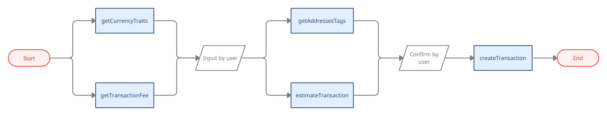
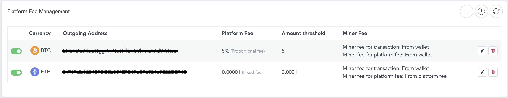
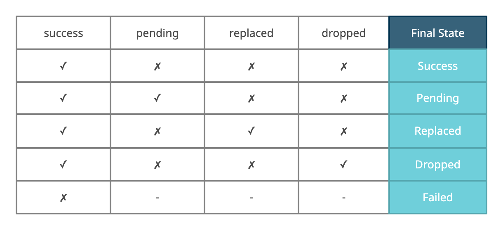

# Transaction

- Bookmarks
  - [Deposit](#deposit)
  - [Withdraw](#withdraw)
  - [Transaction Detail](#transaction-detail)
  - [Transaction Replacement](#transaction-replacement)
  - [Others](#others)

## Deposit

- Select a wallet address, create a new one if needed.
- Generate QR code
- Present the QR code for deposit.

## Withdraw



### getTransactionFee

- To get transaction fees of the selected currency,  
you will get three levels { high, medium, low } of fees for the user to select.
- `tokenAddress` is for private chain usage. For public chain, `tokenAddress` should always be ""
- For example:
  - ETH transaction use ETH as transaction fee ➜ pass `currency: 60, tokenAddress: ""`
  - ERC20 transaction use ETH as transaction fee ➜ pass `currency: 60, tokenAddress: ""`

```java
/// Get transaction transactionFee of specified currency
/// - Parameters:
///   - currency: Currency to query
///   - tokenAddress: fee of private to public transaction
///   - callback: asynchronous callback
public abstract void getTransactionFee(long currency, String tokenAddress, Callback<GetTransactionFeeResult> callback);
```

### getCurrencyTraits

- To get currency traits when you are ready to withdraw.

```java
/// Get currency traits for withdraw restriction
/// - Parameters:
///   - currency: query currency
///   - tokenAddress: query tokenAddress
///   - tokenVersion: query tokenVersion
///   - walletAddress: query walletAddress
///   - callback: asynchronous callback of GetCurrencyTraitsResult
public abstract void getCurrencyTraits(long currency, String tokenAddress, long tokenVersion, String walletAddress, Callback<GetCurrencyTraitsResult> callback);
```

- Response: `GetCurrencyTraitsResult`

    ```java
    public final class GetCurrencyTraitsResult {

        public String granularity = ""; // EPI-777: withdraw must be multiples of granularity

        public String existentialDeposit = ""; // The minimum balance after transaction (ALGO, DOT, KSM)

        public String minimumAccountBalance = ""; // The minimum balance after transaction (XLM, FLOW)
    }
    ```

  - about `granularity`, see [EIP-777](https://eips.ethereum.org/EIPS/eip-777) ➜ search for granularity section
  - about `existentialDeposit`, see [this](https://support.polkadot.network/support/solutions/articles/65000168651-what-is-the-existential-deposit-)

  - about `minimumAccountBalance`, see [this](https://developers.stellar.org/docs/glossary/minimum-balance/)

### estimateTransaction

- Estimate the transaction fees to present for the user.

```java
/// Estimate platform fee / chain fee for given transaction information
/// - Parameters:
///   - currency: Currency of desired new wallet
///   - tokenAddress: Token address for tokens, i.e. an ERC-20 token wallet maps to an Ethereum wallet
///   - amount: Amount to transfer
///   - transactionFee: Transaction transactionFee to pay
///   - walletId: Wallet ID to estimated transaction
///   - toAddress: To Address
///   - callback: asynchronous callback
public abstract void estimateTransaction(long currency, String tokenAddress, String amount, String transactionFee, long walletId, String toAddress, Callback<EstimateTransactionResult> callback);
```

- Response: `EstimateTransactionResult`

    ```java
    public final class EstimateTransactionResult {

        public String tranasctionAmout; // Estimated total amount to transaction

        public String platformFee; // Estimated platform fee of transaction

        public String blockchainFee; // Estimated blockchain fee of transaction

        public String withdrawMin; // Minimum transfer amount for private chain
    }
    ```

  - Administrators can add `platformFee` on admin panel
  

### getAddressesTags

- To get an AML tag for the address.
- Be sure to provide warnings for the user if the address is in the blacklist.

```java
/// Get AML tag for address
/// - Parameters:
///   - currency: query currency
///   - addresses: query address
///   - callback: asynchronous callback
public abstract void getAddressesTags(long currency, String[] addresses, Callback<GetAddressesTagsResult> callback);
```

### createTransaction

- This method will create and broadcast a transaction to blockchain.
- Fulfill the requirement of different types of currencies in the extras field.
- Please use the function with `PinSecret` version, the others are planning to deprecate.
- If you are making SMS transaction, refer to `createTransactionSms`
- If you are making Biometrics transaction, refer to `createTransactionBio`

```java
/// Create a transaction from specified wallet to specified address
/// - Parameters:
///   - fromWalletId: ID of wallet to withdraw from
///   - toAddress: Target address to send
///   - amount: Amount to transfer, token ID for ERC-721, BSC-721
///   - transactionFee: Transaction transactionFee to pay
///   - description: Description of the transaction
///   - pinSecret: PIN secret retrieved via {PinCodeInputView}
///   - extraAttributes: Extra attributes for specific currencies, pass null if unspecified.
///      - Supported extras:
///         1. memo (String) - Memo for XRP, XML, EOS, BNB
///         2. eos_transaction_type (EosResourceTransactionType) - Resource transaction type for EOS, such as buy RAM, delegate CPU
///         3. num_bytes (Long) - Bytes of RAM/NET for EOS RAM delegation/undelegation transactions. The minimal amounts are 1024 bytes
///         4. input_data (String) - Hex string of input data. Must also set gas_limit when have this attributes
///         5. gas_limit (Long) - Must specify this if there were input_data
///         6. skip_email_notification (Boolean) -Determined whether or not to skip sending notification mail after create a transaction
///         7. token_id (String) -token ID for ERC-1155
///         8. kind (String) -kind for private chain, code: private to private; out: private to public
///         9. to_address_tag (String[]) -AML tag, get from getAddressesTags() API
///      - Note:
///         - When eos_transaction_type is EosResourceTransactionType.SELL_RAM, EosResourceTransactionType.UNDELEGATE_CPU or EosResourceTransactionType.UNDELEGATE_NET, the receiver should be address of Wallet fromWalletId
///         - ex: ["memo": "abcd", "eos_transaction_type": EosResourceTransactionType.SELL_RAM.rawValue, "skip_email_notification": false, "kind": "code"]
///   - callback: asynchronous callback
///
public abstract void createTransaction(long fromWalletId, String toAddress, String amount, String transactionFee, String description, PinSecret pinSecret,
                                           Map<String, Object> extraAttributes,
                                           Callback<CreateTransactionResult> callback);
```

## Transaction Detail

### getHistory

- Call this API to get the transaction history.

```java
/// Get transaction history from
/// - Parameters:
///   - currency: Currency of the address
///   - tokenAddress: Token Contract Address of the address
///   - walletAddress: Wallet address
///   - start: Query start offset
///   - count: Query count returned
///   - crosschain: For private chain transaction history filtering. 0: history for private chain transfer; 1: history for crossing private and public chain
///   - filters: Filter parameters:
///     - direction {Transaction.Direction} - Direction of transaction
///     - pending {Boolean} - Pending state of transactions
///     - success {Boolean} - Success state of transactions
///     - start_time {Long} - Start of time period to query, in Unix timestamp
///     - end_time {Long} - End of time period to query, in Unix timestamp
///       - ex: ["direction": Direction.OUT, "pending": true, "start_time": 1632387959]
///   - callback: asynchronous callback
public abstract void getHistory(long currency, String tokenAddress, String walletAddress, int start, int count, int crosschain, Map<String, Object> filters, Callback<GetHistoryResult> callback);
```

- Paging query: you can utilize `start` and `count` to fulfill paging query.  
  - For example:
    - pass `start: transactions.count, count: 10` to get 10 more records when it reaches your load more condition until there's no more transactions.
    - Has more: `result.start` + `result.transactions.length` < `result.total`
- Response: list of `Transaction`

    ```java
    public final class Transaction {

        public String txid = ""; // transaction ID

        public boolean pending = false;

        public boolean success = false;

        public boolean dropped = false; // Is transaction dropped by the blockchain

        public boolean replaced; // Is transaction replaced by another transaction
    
        ...
    }
    ```

    

- If the Tx's final state is `Success` or `Pending`, you could call `getTransactionInfo` to check the information about this Tx on the blockchain.

### getTransactionInfo

- Check the information about the Tx on the blockchain.

```java
/// Get transaction result for given txid.
/// - Parameters:
///   - currency: currency to get transaction result
///   - txid: txid of transaction
///   - callback: asynchronous callback
public abstract void getTransactionInfo(long currency, String txid, Callback<GetTransactionInfoResult> callback);

/// the batch version of getTransactionInfo
public abstract void getTransactionsInfo(long currency, String[] txids, Callback<GetTransactionsInfoResult> callback);
```

## Transaction Replacement

> ⚠️ Warning: Cancel / Accelerate transactions will incur a higher Tx fee for replacing the original Tx.

- If a user wants to Cancel / Accelerate a `Pending` Tx on blockchain.
The user needs to create another Tx with higher Tx fee and the same nonce to replace the original one.
- You can achive Tx replacement by `cancelTransaction` and `increaseTransactionFee` API.
- Condition: `replaceable == true`

  ```java
  public final class Transaction {

      public String txid = "";
      
      public boolean replaceable; // Is transaction replaceable

      public boolean replaced; // Is transaction replaced by another transaction

      public String replaceTxid; // TXID of replacement of this transaction if {@link #replaced} == true

      public int nonce; // Nonce of transaction, only valid on ETH, same nonce means replacements
      
      ...
  }
  ```
  
  - Steps:
    1. Call `getTransactionFee` to get the current Tx fee.
    2. Decide a new Tx fee
        - if (Tx fee > original Tx fee) ➜ use the new Tx fee
        - if (Tx fee <= original Tx fee) ➜ decide a higher Tx fee by your rules
            - Suggestion: In our experience, (original Tx fee) * 1.1 might be a easy way to calculate a new price for doing this operation.
    3. Call `cancelTransaction` for canceling transactions.
    4. Call `increaseTransactionFee` for accelerating transactions.

### Transaction Replacement History

- In the result of `getHistory`, you will need to determine different states for a transaction.
- How to determine a transaction is replaced or not:
    1. filter `platformFee == false` ➜ reduce the transactions which are platform fees.
    2. filter `nonce != 0` ➜ reduce normal transactions
    3. mapping transactions with the same nonce
    4. in a set of transactions:
        - the Tx fee lower one ➜ the original order
        - `if Tx1.amount == Tx2.amount` ➜ is Accelerate transaction operation
        - `if Tx.amount == 0` ➜ is Cancel transaction operation
        - `if Tx1.replaced == false && Tx2.replaced == false` ➜ is operating
        - `if Original-Tx.replaced == true` ➜ Cancel / Accelerate success
        - `if Replacement-Tx.replaced == true` ➜ Cancel / Accelerate failed

## Others

- ABI functions `callAbiFunctionTransaction()`, `callAbiFunctionRead()` see this [Sample](https://github.com/CYBAVO/android_wallet_sdk_sample/blob/4c2840c8e0e20794536b5193776bc99f51d2a6b8/app/src/main/java/com/cybavo/example/wallet/detail/WithdrawFragment.java)