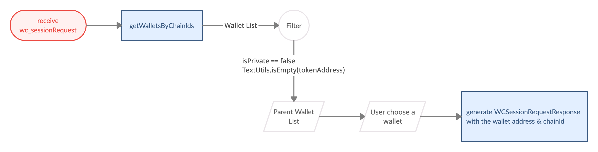

# WalletConnect

> WalletConnect is an open protocol which makes Dapps able to interact with wallets on different platforms.  
> Wallet SDK provides corresponding APIs which help you get the results to return to Dapp, after establishing a wallet client and being able to receive Dapp's request.  
> In later sections, we'll illustrate how to use those APIs to respond to [session request](https://docs.walletconnect.com/tech-spec#session-request) and JSON-RPC call requests which are defined in [JSON-RPC API Methods](https://docs.walletconnect.com/json-rpc-api-methods/ethereum).  
>
> Wallet clients integration on Android : [Kotlin Client (Android)](https://docs.walletconnect.com/quick-start/wallets/kotlin)  
> WalletConnect Introduction: [WalletConnect v1.0](https://docs.walletconnect.com/)

- Bookmark:
  - [Session Request](#session-request)
  - [JSON-RPC Call Requests](#json-rpc-call-requests)
  - [API History](#api-history)
  - [Cancel a Transaction](#cancel-a-transaction)

## [Session Request](https://docs.walletconnect.com/tech-spec#session-request)



- Receiving `wc_sessionRequest` from WalletConnect SDK.
- Call `getWalletsByChainIds(new long[]{-1} ...)` to get all wallets.
- Guide the user to choose a parent wallet.
- Generate `WCSessionRequestResponse` and response to the WalletConnect service by WalletConnect SDK.

  - Response parameters:
    1. `chainId` use `Wallet.chainId`
    2. `accounts` use `Wallet.address`

        ```java
        public final class Wallet {

            public long walletId; // Wallet ID

            public String address = ""; // Wallet address

            public long chainId; // Currency chain ID

            ...
        }
        ```

## [JSON-RPC Call Requests](https://docs.walletconnect.com/json-rpc-api-methods/ethereum)

- ### [personal_sign](https://docs.walletconnect.com/json-rpc-api-methods/ethereum#personal_sign)

  - Use `walletConnectSignMessage()` to sign a message. ➜ Response to WalletConnect
  - Suggestion: `extras.put("is_hex", true)` to avoid encode / decode issues which lead to invalid signatures.

    ```java
    /// Sign message by wallet private key(eth_sign, personal_sign) via WalletConnect
    ///
    /// - This call will be logged as ApiHistoryItem with API name: eth_sign note: Only support ETH & TRX. Result is same as following links:
    /// - ETH: https://github.com/MetaMask/eth-sig-util/blob/v4.0.0/src/personal-sign.ts#L27-L45
    /// - TRX: https://github.com/TRON-US/tronweb/blob/461934e246707bca41529ab82ebe76cf894ab460/src/lib/trx.js#L712-L731
    ///
    /// - Parameters:
    ///   - walletId: ID of wallet
    ///   - message: message to sign
    ///   - pinSecret: PIN secret retrieved via PinCodeInputView
    ///   - extraAttributes: Extra attributes for specific currencies, pass null if unspecified.
    ///       - Supported extras:
    ///           - eip155 (Boolean) = true - Use EIP 155 format to sign message
    ///           - is_hex (Boolean) = true - Send Hex as message
    ///           - legacy (Boolean) = true - Use legacy sign and suggest send hex as message(is_hex set true)
    ///   - callback: asynchronous callback of signedMessage
    public abstract void walletConnectSignMessage(long walletId, String message, PinSecret pinSecret, Map<String,Object> extraAttributes, Callback<SignMessageResult> callback);
    ```

    - Use different functions for biometrics & SMS Verification: see [this](bio_n_sms.md#biometrics--sms-verification-for-transaction-and-sign-operation)

- ### [eth_sign](https://docs.walletconnect.com/json-rpc-api-methods/ethereum#eth_sign)

  - as above, **_personal_sign_**

- ### [eth_signTypedData](https://docs.walletconnect.com/json-rpc-api-methods/ethereum#eth_signtypeddata)

  - Use `walletConnectSignTypedData()` to sign a typed data. ➜ Response to WalletConnect

    ```java
    /// Sign typed data(eth_signTypedData) via WalletConnect, this call will be logged as ApiHistoryItem with API
    /// - API eth_signTypedData: https://docs.walletconnect.org/json-rpc-api-methods/ethereum#eth_signtypeddata
    ///
    /// - Parameters:
    ///   - walletId: wallet ID
    ///   - typedData: typed data json string
    ///   - pinSecret: PIN secret retrieved via PinCodeInputView
    ///   - callback: asynchronous callback of SignedRawTxResult
    public abstract void walletConnectSignTypedData(long walletId, String typedData, PinSecret pinSecret, Callback<SignedRawTxResult> callback);
    ```

    - Use different functions for biometrics & SMS Verification: see [this](bio_n_sms.md#biometrics--sms-verification-for-transaction-and-sign-operation)
    - Always check and send valid `typedData`. More specification: see [this](https://eips.ethereum.org/EIPS/eip-712#specification-of-the-eth_signtypeddata-json-rpc)

- ### [eth_signTransaction](https://docs.walletconnect.com/json-rpc-api-methods/ethereum#eth_signtransaction)

    1. Check and adjust the Tx object if necessary, the Tx object must at least contain `gas`, `gasPrice` and `nonce`.  
    You can use `getEstimateGas`, `getTransactionFee` and `getNonce` to get corresponding values and set its hex string to the Tx object.
    2. Use `walletConnectSignTransaction()` to sign a transaction. ➜ Response to WalletConnect

        ```java
        /// Signs a transaction(eth_signTransaction) via WalletConnect, this call will be logged as ApiHistoryItem with API name:
        /// - eth_signTransaction - https://docs.walletconnect.org/json-rpc-api-methods/ethereum#eth_signtransaction
        ///
        /// - Parameters
        ///   - walletId: wallet ID
        ///   - signParams: transaction object json string
        ///   - pinSecret: PIN secret retrieved via PinCodeInputView
        ///   - callback: asynchronous callback of SignedRawTxResult
        public abstract void walletConnectSignTransaction(long walletId, String signParams, PinSecret pinSecret, Callback<SignedRawTxResult> callback);
        ```

- ### [eth_sendRawTransaction](https://docs.walletconnect.com/json-rpc-api-methods/ethereum#eth_sendrawtransaction)

    1. use `walletConnectSendSignedTransaction()` to get the `txid`.
    2. During some transactions, you may receive new currencies / tokens which don't exist in the currency list, like swapping a new type of token.
    3. call `Wallets.getInstance().walletConnectSync` to add currencies and wallets which are created by `walletConnectSendSignedTransaction`.
    4. call `Wallets.getInstance().getWallets` to get the new wallet list

- ### [eth_sendTransaction](https://docs.walletconnect.com/json-rpc-api-methods/ethereum#eth_sendtransaction)

    1. Use `walletConnectSignTransaction()` in the previous section to get the `signedTx`.
    2. Second, use `walletConnectSendSignedTransaction()` to get the `txid`. ➜ Response to WalletConnect

        ```java
        /// Create transaction by signed transaction(eth_sendTransaction) via WalletConnect, this call will be logged as ApiHistoryItem with API name: eth_sendRawTransaction
        /// - Parameters:
        ///   - walletId: wallet ID
        ///   - signedTx: signed transaction
        ///   - callback: asynchronous callback of SendSignedTxResult
        public abstract void walletConnectSendSignedTransaction(long walletId, String signedTx, Callback<SendSignedTxResult> callback);
        ```

    3. During some transactions, you may receive new currencies / tokens which don't exist in the currency list, like swapping a new type of token.
    4. call `Wallets.getInstance().walletConnectSync` to add currencies and wallets which are created by `walletConnectSendSignedTransaction`.
    5. call `Wallets.getInstance().getWallets` to get the new wallet list

## API History

- Call `getWalletConnectApiHistory` to get WalletConnect API history.

    ```java
    /// Get WalletConnect API history without filter 
    /// 1. walletConnectSignTypedData(long, String, PinSecret, Callback)
    /// 2. walletConnectSignTransaction(long, String, PinSecret, Callback)
    /// 3. walletConnectSignMessage(long, String, PinSecret, Map, Callback)
    /// 4. walletConnectSendSignedTransaction(long, String, Callback)
    ///
    /// - Parameters:
    ///   - walletId: wallet ID
    ///   - start: Query start offset
    ///   - count: Query count returned
    ///   - filters: Filter parameters:
    ///     - api_name (String) - API name
    ///     - start_time (Long) - Start of time period to query, in Unix timestamp
    ///     - end_time (Long) - End of time period to query, in Unix timestamp
    ///   - callback: asynchronous callback of GetApiHistoryResult
    public abstract void getWalletConnectApiHistory(long walletId, int start, int count, Map<String, Object> filters, Callback<GetApiHistoryResult> callback);
    ```

## Cancel a Transaction

- In list of `ApiHistoryItem`

    ```java
    public final class ApiHistoryItem {

        public String apiName = ""; // API Name

        public String accessId = ""; // access ID for eth_sendRawTransaction

        public int status = Status.DONE.ordinal(); // ApiHistoryItem status { WAITING, FAILED, DONE, DROPPED }

        public Long nonce = 0l; // Used nonce

        public String gasPrice = "" // Gas price

        public String gasLimit = "" // Gas limit

        ...
    }
    ```

- How to determine if a transaction can be canceled or not?
    1. `apiName.equals("eth_sendRawTransaction")`
    2. `TextUtils.isEmpty(accessId) == false`
    3. `status == ApiHistoryItem.Status.WAITING.ordinal()`

- How to cancel a transaction?
    1. Decide a new transaction fee.
    2. Call `cancelWalletConnectTransaction` to cancel a WalletConnect Transaction

- How to decide the new transaction fee?
    1. Call `getTransactionFee` to get the current Tx fee.
    2. Decide a new Tx fee
        - if (Tx fee > original Tx fee) ➜ use the new Tx fee
        - if (Tx fee <= original Tx fee) ➜ decide a higher Tx fee by your rules
            - Suggestion: In our experience, (original Tx fee) * 1.1 might be an easy way to calculate a new price for doing this operation.
    3. same as [Transaction_Replacement](transaction.md#transaction-replacement)

- How to see the cancel history?
    1. In list of `ApiHistoryItem`
        - filter `apiName.equals("eth_sendRawTransaction")` ➜ original Tx operation
        - filter `apiName.equals("eth_cancelTransaction")` ➜ cancel Tx operation
        - Use `nonce` to map same pair of operations
    2. In same pair of operations:
        - When cancel operation's `status == ApiHistoryItem.Status.DONE.ordinal()` means cancel operation success.
        - When origin Tx operation's `status == ApiHistoryItem.Status.DONE.ordinal()` means cancel operation failed. The original Tx was succeeded.
    3. refer to [Transaction Replacement History](transaction.md#transaction-replacement-history)
