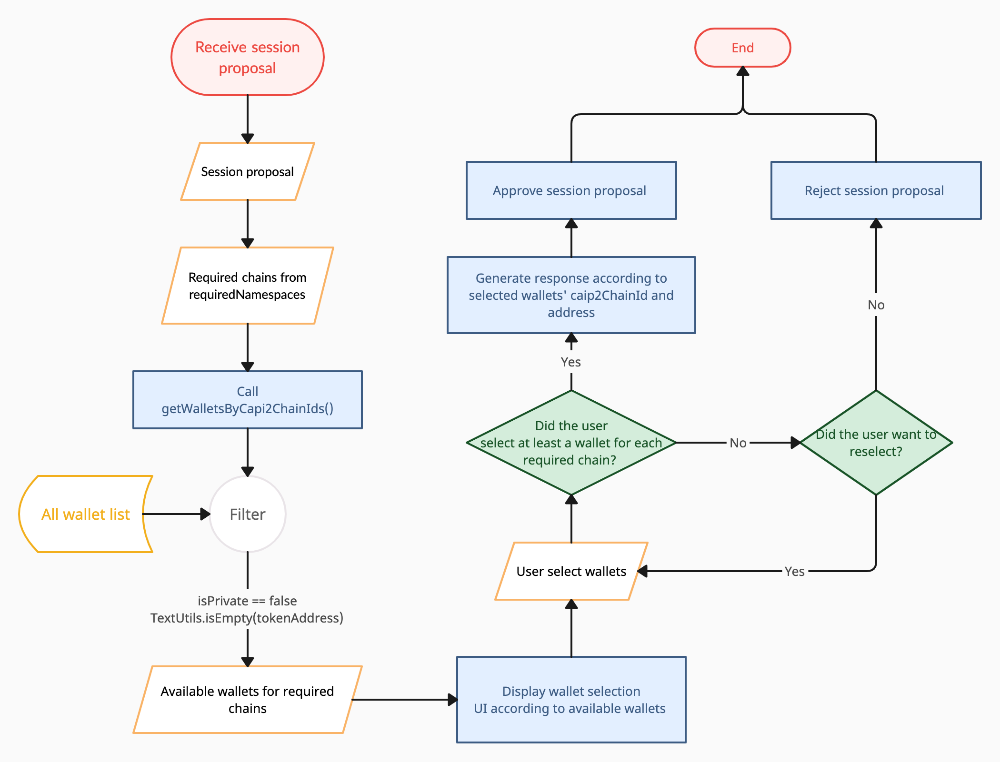
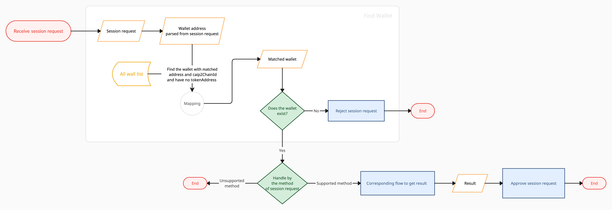
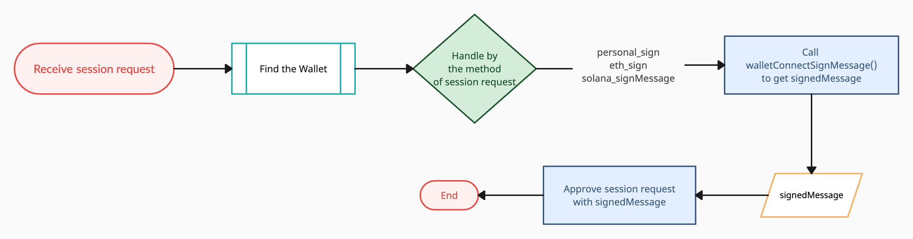
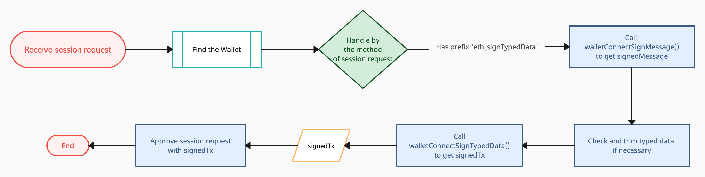
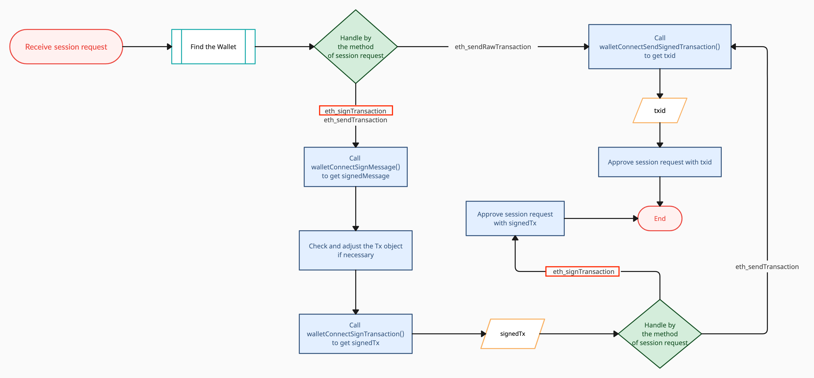
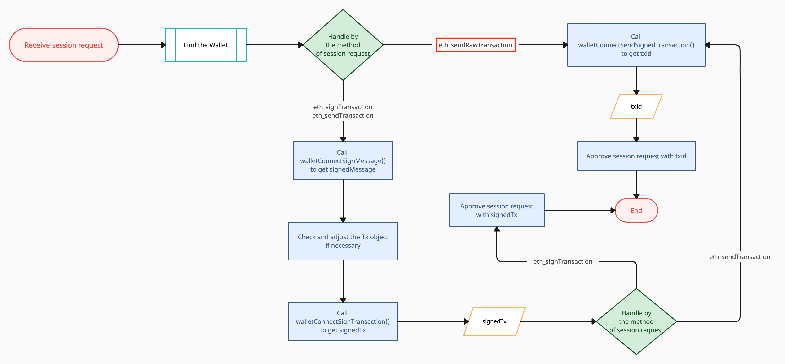
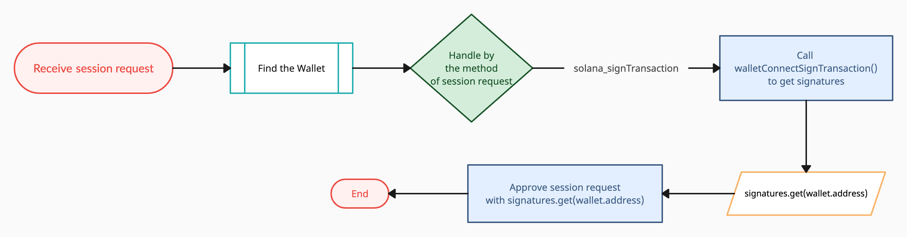

# WalletConnect

>&emsp;WalletConnect is the decentralized Web3 messaging layer and a standard to connect blockchain wallets to Dapps. They have developed different groups of API for different uses. Sign API is the one that will be covered in this document.
>
> &emsp;WalletConnect Sign is a remote protocol designed for secure peer-to-peer communication between Dapps (web3 applications) and wallets. WalletSDK provides corresponding APIs which help you to get the results to return to Dapp.  
>
> &emsp;In later sections, we'll illustrate how to use APIs to respond to session proposals and the JSON-RPC session requests we support.  
>
> WalletConnect Android integration: [Web3Wallet](https://docs.walletconnect.com/2.0/android/web3wallet/installation)  
> WalletConnect Introduction: [WalletConnect v2.0](https://docs.walletconnect.com/2.0/)


- Bookmark:
  - [Multi-Chain Support](#multi-chain-support)
  - [Session Proposal](#session-proposal)
  - [Sessions Request](#session-request)
    - [Sign Message](#sign-message)
        - [personal_sign](#personal_sign)
        - [eth_sign](#eth_sign)
        - [solana_signMessage](#solana_signmessage)
    - [eth_signTypedData](#eth_signtypeddata)
    - [eth_signTransaction](#eth_signtransaction)
    - [eth_sendRawTransaction](#eth_sendrawtransaction)
    - [solana_signTransaction]()
  - [API History](#api-history)
  - [Cancel a Transaction](#cancel-a-transaction)

## Multi-Chain Support
&emsp;WalletConnect v2.0 uses [namespace](https://docs.walletconnect.com/2.0/advanced/glossary#namespaces), chain and account to specify the group of chain, chain and an address on a certain chain. You can find corresponding fields on Wallet and Currency.
  ```java
  public final class Wallet {

    /** Wallet Address */
    public String  address = "";

    /** CAIP-2 chain ID of supported chain for WalletConnect */
    public String caip2ChainId = ""; // e.g. "eip155:1" for Ethereum Mainnet

    /** Name of supported chain for WalletConnect */
    public String chainName = "";
    
    ...
  }
  ```
  ```java
  public final class Currency = {

    /** CAIP-2 chain ID of supported chain for WalletConnect */
    public String caip2ChainId = ""; // e.g. "eip155:1" for Ethereum Mainnet

    /** Name of supported chain for WalletConnect */
    public String chainName = "";
    
    ...
  }
  ```
&emsp;⚠️ WalletSDK supports `eip155` and `solana` for now, which means `caip2ChainId` and `chainName` are only available for EVM compatible and Solana wallets and currencies.

## [Session Proposal](https://docs.walletconnect.com/2.0/javascript/sign/wallet-usage#pairing-with-uri)



1. &emsp;Receiving session proposal from WalletConnect SDK. Each namespace in proposal's requiredNamespaces contains the list of chains, methods and events that are required from the Dapp.    
&emsp;For example, user choose "Ethereum Goerli", "Polygon Mumbai" and "Solana Devnet" to connect, the received proposal lists 2 namespaces under `requiredNamespaces`: `eip155` and `solana`, and the selected chains are listed in each namespace's `chains`: `"eip155:5"`, `"eip155:80001"` and `"solana:8E9rvCKLFQia2Y35HXjjpWzj8weVo44K"`.

<details open>
  <summary>Example Session Proposal</summary>
  

  ```js
  {
    "id": 1672214749761550,
    "params": {
        "id": 1672214749761550,
        "pairingTopic": "dbeb4fb2ce673c7ba4319897a3ac9a9a9134b2b4373918eed3bd9362fcc1f02e",
        "expiry": 1672215058,
        "requiredNamespaces": {
            "eip155": {
                "methods": [
                    "eth_sendTransaction",
                    "eth_signTransaction",
                    "eth_sign",
                    "personal_sign",
                    "eth_signTypedData"
                ],
                "chains": [
                    "eip155:5",// Ethereum Goerli
                    "eip155:80001"// Polygon Mumbai
                ],
                "events": [
                    "chainChanged",
                    "accountsChanged"
                ]
            },
            "solana": {
                "methods": [
                    "solana_signTransaction",
                    "solana_signMessage"
                ],
                "chains": [
                    "solana:8E9rvCKLFQia2Y35HXjjpWzj8weVo44K" // Solana Devnet
                ],
                "events": []
            }
        },
        "relays": [
            {
                "protocol": "irn"
            }
        ],
        "proposer": {
            "publicKey": "7d5864d1141f1c18e5b953bd5387c38e82bac5ae92b9dbc8fbf6bcf59d129d1c",
            "metadata": {
                "description": "React App for WalletConnect",
                "url": "https://react-app.walletconnect.com",
                "icons": [
                    "https://avatars.githubusercontent.com/u/37784886"
                ],
                "name": "React App"
            }
        }
    }
}
  ```
</details>


&emsp; To approve the proposal, the response needs to contain `accounts` -- the list of CAIP-2 chain ID with wallet address -- for every required chain. For detailed validation cases please check [this](https://docs.walletconnect.com/2.0/specs/clients/sign/session-namespaces#controller-side-validation-of-incoming-proposal-namespaces-wallet).

&emsp; In the example below, the user selected 2 "Ethereum Goerli", 1 "Polygon Mumbai" and 2 "Solana Devnet" wallets.
<details open>
  <summary>Example Session Proposal Approval Response</summary>
  

  ```js
  {
    "id": 1672214749761550,
    "relayProtocol": "irn",
    "namespaces": {
        "eip155": {
            "accounts": [
                "eip155:5:0x430dF37e50275290EE3c35524aFa26EfcCcb7A61",
                "eip155:5:0xb9C52884871D703a113bB8D377EB138e4085D494",
                "eip155:80001:0x430dF37e50275290EE3c35524aFa26EfcCcb7A61"
            ],
            "methods": [
                "eth_sendTransaction",
                "eth_signTransaction",
                "eth_sign",
                "personal_sign",
                "eth_signTypedData"
            ],
            "events": [
                "chainChanged",
                "accountsChanged"
            ]
        },
        "solana": {
            "accounts": [
                "solana:8E9rvCKLFQia2Y35HXjjpWzj8weVo44K:CEmbV43bmBMVTqAxJbNuDxzE8MxsUYRkYdN9umByBvu2",
                "solana:8E9rvCKLFQia2Y35HXjjpWzj8weVo44K:GKoP9vNDaxKTRjxaj24C1HL9qbDzjyYhNX1C2K1avSHH"
            ],
            "methods": [
                "solana_signTransaction",
                "solana_signMessage"
            ],
            "events": []
        }
    }
}
  ```
</details>

3. &emsp; Next, call `getWalletsByCaip2ChainIds() ` to get available wallets. 
    ```java
    /// Get wallet list by CAIP-2 chain IDs of signed in user. chainId of returned wallet is not available.
    /// - Parameters:
    ///   - caip2ChainIds: CAIP-2 chain IDs
    ///   - callback: asynchronous callback of GetWalletsResult
    public abstract void getWalletsByCaip2ChainIds(String[] caip2ChainIds, Callback<GetWalletsResult> callback);
    ```
    &emsp;You can also use the result of `walletConnectGetSupportedChain()` to check if the chain is supported.

    ```java
    /// Get supported chain as a map for WalletConnect. The map key is CAIP-2 chain ID.
    /// - Parameters:
    ///   - callback: asynchronous callback of WalletConnectGetSupportedChainResult
    public abstract void getWalletsByCaip2ChainIds(String[] caip2ChainIds, Callback<GetWalletsResult> callback);
    ```
4. Approve session proposal with proposer's public key and namespaces, see [Session Approval](https://docs.walletconnect.com/2.0/android/web3wallet/wallet-usage#session-approval).


## Session Request

 &emsp; Here is the general flow for handling session request. When a session request is coming, you may need to identify the wallet by address from request parameters and chain ID from the request then get corresponding result and approve.    

### Sign Message

&emsp; For [personal_sign](https://docs.walletconnect.com/2.0/advanced/rpc-reference/ethereum-rpc#personal_sign), [eth_sign](https://docs.walletconnect.com/2.0/advanced/rpc-reference/ethereum-rpc#eth_sign) and [solana_signMessage](https://docs.walletconnect.com/2.0/advanced/rpc-reference/solana-rpc#solana_signmessage), use `walletConnectSignMessage()` to sign a message. However, the parameters are slightly different among those methods. Please check the following examples and usages.   
 ```java
    /// Sign message by wallet private key(eth_sign, personal_sign) via WalletConnect
    ///
    /// - This call will be logged as ApiHistoryItem with API name: eth_sign note: Only support ETH & TRX. Result is same as following links:
    /// - ETH: https://github.com/MetaMask/eth-sig-util/blob/v4.0.0/src/personal-sign.ts#L27-L45
    /// - TRX: https://github.com/TRON-US/tronweb/blob/461934e246707bca41529ab82ebe76cf894ab460/src/lib/trx.js#L712-L731
    ///
    /// - Parameters:
    ///   - walletId: ID of wallet
    ///   - message: message to sign
    ///   - pinSecret: PIN secret retrieved via PinCodeInputView
    ///   - extraAttributes: Extra attributes for specific currencies, pass null if unspecified.
    ///       - Supported extra attributes:
    ///           - eip155 (Boolean) = true - Use EIP 155 format to sign message
    ///           - is_hex (Boolean) = true - Send Hex as message
    ///           - legacy (Boolean) = true - Use legacy sign and suggest send hex as message(is_hex set true), please also check confirmed_action_token for EVM compatible currency
    ///           - confirmed_action_token (String) - It's required for these 2 cases:
    ///             - SOL
    ///             - EVM compatible currency and legacy is true
    ///             Get the action token from getSignMessageActionToken(), otherwise, the API will return Error.Code.ErrActionTokenInvalid error code
    ///   - callback: asynchronous callback of signedMessage
    public abstract void walletConnectSignMessage(long walletId, String message, PinSecret pinSecret, Map<String,Object> extraAttributes, Callback<SignMessageResult> callback);
```
  - Use different functions for biometrics & SMS Verification: see [this](bio_n_sms.md#biometrics--sms-verification-for-transaction-and-sign-operation)

- ### [personal_sign](https://docs.walletconnect.com/2.0/advanced/rpc-reference/ethereum-rpc#personal_sign)
    <details>
        <summary>Click for personal_sign Request</summary>

    ```json
    {
        "id": 1672223269502696,
        "topic": "8df572b8c9d9406a72696ce52ff503946870649936970a9e9b7328fa4b27f68f",
        "params": {
            "request": {
                "method": "personal_sign",
                "params": [
                    "0x4d7920656d61696c206973206a6f686e40646f652e636f6d202d2031363732323233323639343935",
                    "0xb9C52884871D703a113bB8D377EB138e4085D494"
                ]
            },
            "chainId": "eip155:5"
        }
    }
    ```
    </details>

  - It is suggested that set `extraAttributes.put("is_hex", true)` and pass the message in hex to avoid encode / decode issues which lead to invalid signatures.
  - For extraAttributes `legacy` and `confirmed_action_token`, please check [Get Action Token for Sign Message](transaction.md#get-action-token-for-sign-message) for more detail.
  - This call will be logged as ApiHistoryItem with API name: `eth_sign`.
   
- ### [eth_sign](https://docs.walletconnect.com/2.0/advanced/rpc-reference/ethereum-rpc#eth_sign)

  - As above -- [personal_sign](#personal_sign).
  - The only difference is the order of message in the `params`.
  
- ### [solana_signMessage](https://docs.walletconnect.com/2.0/advanced/rpc-reference/solana-rpc#solana_signmessage)

    <details>
    <summary>Click for solana_signMessage Request</summary>
    

    ```json
    {
        "id": 1672231051067105,
        "topic": "c7fe2e6f5e3fa9ddbc12cb0d266c0e48e4ee6eeca4d78867f5e8140c94c33f6c",
        "params": {
            "request": {
                "method": "solana_signMessage",
                "params": {
                    "pubkey": "CEmbV43bmBMVTqAxJbNuDxzE8MxsUYRkYdN9umByBvu2",
                    "message": "X3CUgCGzyn43DTAbUKnTMDzcGWMooJT2hPSZinjfN1QUgVNYYfeoJ5zg6i4MYLZ4DrqSAccEQPd"
                }
            },
            "chainId": "solana:8E9rvCKLFQia2Y35HXjjpWzj8weVo44K"
        }
    }
    ```
    </details>

   - `confirmed_action_token` is the only extra attribute needed for solana_signMessage. See [Get Action Token for Sign Message](transaction.md#get-action-token-for-sign-message).
   - This call will be logged as ApiHistoryItem with API name: `solana_sign`.

- ### [eth_signTypedData](https://docs.walletconnect.com/2.0/advanced/rpc-reference/ethereum-rpc#eth_signtypeddata)
  

  <details>
    <summary>Click for eth_signTypedData Request</summary>
    

    ```json
    {
      "id": 1672227194833117,
      "topic": "8df572b8c9d9406a72696ce52ff503946870649936970a9e9b7328fa4b27f68f",
      "params": {
          "request": {
              "method": "eth_signTypedData",
              "params": [
                  "0x430dF37e50275290EE3c35524aFa26EfcCcb7A61",
                  "{\"types\":{\"EIP712Domain\":[{\"name\":\"name\",\"type\":\"string\"},{\"name\":\"version\",\"type\":\"string\"},{\"name\":\"chainId\",\"type\":\"uint256\"},{\"name\":\"verifyingContract\",\"type\":\"address\"}],\"Person\":[{\"name\":\"name\",\"type\":\"string\"},{\"name\":\"wallet\",\"type\":\"address\"}],\"Mail\":[{\"name\":\"from\",\"type\":\"Person\"},{\"name\":\"to\",\"type\":\"Person\"},{\"name\":\"contents\",\"type\":\"string\"}]},\"primaryType\":\"Mail\",\"domain\":{\"name\":\"Ether Mail\",\"version\":\"1\",\"chainId\":1,\"verifyingContract\":\"0xCcCCccccCCCCcCCCCCCcCcCccCcCCCcCcccccccC\"},\"message\":{\"from\":{\"name\":\"Cow\",\"wallet\":\"0xCD2a3d9F938E13CD947Ec05AbC7FE734Df8DD826\"},\"to\":{\"name\":\"Bob\",\"wallet\":\"0xbBbBBBBbbBBBbbbBbbBbbbbBBbBbbbbBbBbbBBbB\"},\"contents\":\"Hello, Bob!\"}}"
              ]
          },
          "chainId": "eip155:44787"
      }
  }
    ```
    </details>

  1. Check and trim typed data if necessary. See [this](https://github.com/ethereum/EIPs/blob/master/EIPS/eip-712.md#specification-of-the-eth_signtypeddata-json-rpc) for typed data definition.
  2. Use `walletConnectSignTypedData()` to sign a typed data, and approve the request with `signedTx`.
    ```java
    /// Sign typed data(eth_signTypedData) via WalletConnect, this call will be logged as ApiHistoryItem with API
    /// - API eth_signTypedData: https://docs.walletconnect.org/json-rpc-api-methods/ethereum#eth_signtypeddata
    ///
    /// - Parameters:
    ///   - walletId: wallet ID
    ///   - typedData: typed data json string
    ///   - pinSecret: PIN secret retrieved via PinCodeInputView
    ///   - callback: asynchronous callback of SignedRawTxResult
    public abstract void walletConnectSignTypedData(long walletId, String typedData, PinSecret pinSecret, Callback<SignedRawTxResult> callback);
    ```

    - Use different functions for biometrics & SMS Verification: see [this](bio_n_sms.md#biometrics--sms-verification-for-transaction-and-sign-operation)

- ### [eth_signTransaction](https://docs.walletconnect.com/2.0/advanced/rpc-reference/ethereum-rpc#eth_signtransaction)
  

    <details>
        <summary>Click for eth_signTransaction Request</summary>
        

    ```js
    {
        "id": 1672229012350497,
        "topic": "34ab31b24c6b35611bd246cc533a7a84cd3ee73a52654e7557b819ed07e94c26",
        "params": {
            "request": {
                "method": "eth_signTransaction",
                "params": [
                    // Before triggering onSessionRequest(), WalletSDK will unify the hex value of nonce and gas, e.g. transform "0x00" to "0x0".
                    {
                        "from": "0x430dF37e50275290EE3c35524aFa26EfcCcb7A61",
                        "to": "0x430dF37e50275290EE3c35524aFa26EfcCcb7A61",
                        "data": "0x",
                        "nonce": "0x0", 
                        "gasPrice": "0x026cadf4",
                        "gas": "0x5208", // Before triggering onSessionRequest(), if the key is gasLimit, WalletSDK will change it to gas.
                        "value": "0x0" 
                    }
                ]
            },
            "chainId": "eip155:5"
        }
    }
    ```
    </details>

    1. Use `walletConnectSignTransaction()` to sign a transaction, and approve the request with `signedTx`.
        - You can use `getTransactionFee()` and `getEstimateGas()` to get corresponding values and set its hex string to the Tx object. 

        ```java
        /// Signs a transaction(eth_signTransaction) via WalletConnect, this call will be logged as ApiHistoryItem with API name:
        /// - eth_signTransaction - https://docs.walletconnect.org/json-rpc-api-methods/ethereum#eth_signtransaction
        ///
        /// - Parameters
        ///   - walletId: wallet ID
        ///   - signParams: transaction object json string
        ///   - pinSecret: PIN secret retrieved via PinCodeInputView
        ///   - callback: asynchronous callback of SignedRawTxResult
        public abstract void walletConnectSignTransaction(long walletId, String signParams, PinSecret pinSecret, Callback<SignedRawTxResult> callback);
        ```

- ### [eth_sendRawTransaction](https://docs.walletconnect.com/2.0/advanced/rpc-reference/ethereum-rpc#eth_sendrawtransaction)
  

    - Use `walletConnectSendSignedTransaction()` to broadcast and get the `txid`, and approve the request with `txid`.
        - For some transactions, you may receive new currencies / tokens which do not exist in the currency list, like swapping a new type of token.
        - Call `walletConnectSync()` to add currencies and wallets which are created by `walletConnectSendSignedTransaction()`.
        - Call `Wallets.getInstance().getWallets` to get the new wallet list.

    
    ```java
    /// Create transaction by signed transaction(eth_sendTransaction) via WalletConnect, this call will be logged as ApiHistoryItem with API name: eth_sendRawTransaction
    /// - Parameters:
    ///   - walletId: wallet ID
    ///   - signedTx: signed transaction
    ///   - callback: asynchronous callback of SendSignedTxResult
    public abstract void walletConnectSendSignedTransaction(long walletId, String signedTx, Callback<SendSignedTxResult> callback);
    ```

- ### [eth_sendTransaction](https://docs.walletconnect.com/2.0/advanced/rpc-reference/ethereum-rpc#eth_sendtransaction)
  
    <details>
    <summary>Click for eth_sendTransaction Request</summary>

    ```js
    {
        "id": 1672230293725650,
        "topic": "34ab31b24c6b35611bd246cc533a7a84cd3ee73a52654e7557b819ed07e94c26",
        "params": {
            // Before triggering onSessionRequest(), WalletSDK will unify the hex value of nonce and gas, e.g. transform "0x00" to "0x0".
            "request": {
                "method": "eth_sendTransaction",
                "params": [
                    {
                        "from": "0x430dF37e50275290EE3c35524aFa26EfcCcb7A61",
                        "to": "0x430dF37e50275290EE3c35524aFa26EfcCcb7A61",
                        "data": "0x",
                        "nonce": "0x0",
                        "gasPrice": "0x02999f58",
                        "gas": "0x5208", // Before triggering onSessionRequest(), if the key is gasLimit, WalletSDK will change it to gas.
                        "value": "0x0"
                    }
                ]
            },
            "chainId": "eip155:5"
        }
    }
    ```
    </details>

    1. Use `walletConnectSignTransaction()` to get the `signedTx`. This part is same as [eth_signTransaction](#eth_signtransaction).  
    2. Use `walletConnectSendSignedTransaction()` to get the `txid`, and approve the request with `txid`. This part is same as [eth_sendRawTransaction](#eth_sendrawtransaction).  

- ### [solana_signTransaction](https://docs.walletconnect.com/2.0/advanced/rpc-reference/solana-rpc#solana_signtransaction)
  

    <details>
        <summary>Click for solana_signTransaction Request</summary>
        
    ```json
    {
        "id": 1672231449119771,
        "topic": "c7fe2e6f5e3fa9ddbc12cb0d266c0e48e4ee6eeca4d78867f5e8140c94c33f6c",
        "params": {
            "request": {
                "method": "solana_signTransaction",
                "params": {
                    "feePayer": "CEmbV43bmBMVTqAxJbNuDxzE8MxsUYRkYdN9umByBvu2",
                    "recentBlockhash": "9er153tkRhsuoA2nMEbpbVF1akjK3yKKKKxyPGsTSTfH",
                    "instructions": [
                        {
                            "programId": "11111111111111111111111111111111",
                            "data": [
                                2,
                                0,
                                0,
                                0,
                                1,
                                0,
                                0,
                                0,
                                0,
                                0,
                                0,
                                0
                            ],
                            "keys": [
                                {
                                    "isSigner": true,
                                    "isWritable": true,
                                    "pubkey": "CEmbV43bmBMVTqAxJbNuDxzE8MxsUYRkYdN9umByBvu2"
                                },
                                {
                                    "isSigner": false,
                                    "isWritable": true,
                                    "pubkey": "FRyMd4MGc2FXgpueDnPL25WzMYyvyrugFJgCDc4ZFGNA"
                                }
                            ]
                        }
                    ]
                }
            },
            "chainId": "solana:8E9rvCKLFQia2Y35HXjjpWzj8weVo44K"
        }
    }
    ```
    </details>

    - Use `walletConnectSignTransaction()` to sign a transaction, and approve the request with `signatures.get(wallet.address)`.
    - This call will be logged as ApiHistoryItem with API name: `solana_signTransaction`.
        ```java
        /// Signs a transaction(eth_signTransaction) via WalletConnect, this call will be logged as ApiHistoryItem with API name:
        /// - eth_signTransaction - https://docs.walletconnect.org/json-rpc-api-methods/ethereum#eth_signtransaction
        ///
        /// - Parameters
        ///   - walletId: wallet ID
        ///   - signParams: transaction object json string
        ///   - pinSecret: PIN secret retrieved via PinCodeInputView
        ///   - callback: asynchronous callback of SignedRawTxResult
        public abstract void walletConnectSignTransaction(long walletId, String signParams, PinSecret pinSecret, Callback<SignedRawTxResult> callback);
        ```
        ```java
        public final class SignedRawTxResult {

            /** Signed Transaction */
            public String signedTx = "";
            /** The map of wallet address and signature of signed transaction */
            public Map<String, String> signatures;
        }
        ```

## API History

- Call `getWalletConnectApiHistory` to get WalletConnect API history.

    ```java
    /// Get WalletConnect API history without filter 
    /// 1. walletConnectSignTypedData(long, String, PinSecret, Callback)
    /// 2. walletConnectSignTransaction(long, String, PinSecret, Callback)
    /// 3. walletConnectSignMessage(long, String, PinSecret, Map, Callback)
    /// 4. walletConnectSendSignedTransaction(long, String, Callback)
    ///
    /// - Parameters:
    ///   - walletId: wallet ID
    ///   - start: Query start offset
    ///   - count: Query count returned
    ///   - filters: Filter parameters:
    ///     - api_name (String) - API name
    ///     - start_time (Long) - Start of time period to query, in Unix timestamp
    ///     - end_time (Long) - End of time period to query, in Unix timestamp
    ///   - callback: asynchronous callback of GetApiHistoryResult
    public abstract void getWalletConnectApiHistory(long walletId, int start, int count, Map<String, Object> filters, Callback<GetApiHistoryResult> callback);
    ```
- WalletSDK also provides `getWalletConnectSignedTx` and `getWalletConnectUnsignedData` for further needs.

    ```java
    /// Get signed TX for walletConnectSendSignedTransaction()
    ///   - Parameters:
    ///   - walletId: wallet ID
    ///   - accessId: accessId from API history
    ///   - callback: asynchronous callback of GetWalletConnectSignedTxResult
    public abstract void getWalletConnectSignedTx(long walletId, String accessId, Callback<GetWalletConnectSignedTxResult> callback);

    /// Get unsigned data for walletConnectSignTypedData() and walletConnectSignTransaction()
    ///   - Parameters:
    ///   - walletId: wallet ID
    ///   - accessId: accessId from API history
    ///   - callback: asynchronous callback of GetWalletConnectUnsignedDataResult
    public abstract void getWalletConnectUnsignedData(long walletId, String accessId, Callback<GetWalletConnectUnsignedDataResult> callback);
    ```

## Cancel a Transaction

- In list of `ApiHistoryItem`

    ```java
    public final class ApiHistoryItem {

        public String apiName = ""; // API Name

        public String accessId = ""; // access ID for eth_sendRawTransaction

        public int status = Status.DONE.ordinal(); // ApiHistoryItem status { WAITING, FAILED, DONE, DROPPED }

        public Long nonce = 0l; // Used nonce

        public String gasPrice = "" // Gas price

        public String gasLimit = "" // Gas limit

        ...
    }
    ```

- How to determine if a transaction can be canceled or not?
    1. `apiName.equals("eth_sendRawTransaction")`
    2. `TextUtils.isEmpty(accessId) == false`
    3. `status == ApiHistoryItem.Status.WAITING.ordinal()`

- How to cancel a transaction?
    1. Decide a new transaction fee.
    2. Call `cancelWalletConnectTransaction` to cancel a WalletConnect Transaction.

- How to decide the new transaction fee?
    1. Call `getTransactionFee` to get the current Tx fee.
    2. Decide a new Tx fee
        - If (Tx fee > original Tx fee) ➜ Use the new Tx fee
        - If (Tx fee <= original Tx fee) ➜ Decide a higher Tx fee by your rules
            - Suggestion: in our experience, (original Tx fee) * 1.1 might be an easy way to calculate a new price for doing this operation.
    3. Same as [Transaction_Replacement](transaction.md#transaction-replacement)

- How to see the cancel history?
    1. In list of `ApiHistoryItem`
        - Filter `apiName.equals("eth_sendRawTransaction")` ➜ Original Tx operation
        - Filter `apiName.equals("eth_cancelTransaction")` ➜ Cancel Tx operation
        - Use `nonce` to map same pair of operations
    2. In same pair of operations:
        - When cancel operation's `status == ApiHistoryItem.Status.DONE.ordinal()` means cancel operation success.
        - When origin Tx operation's `status == ApiHistoryItem.Status.DONE.ordinal()` means cancel operation failed. The original Tx was succeeded.
    3. Refer to [Transaction Replacement History](transaction.md#transaction-replacement-history)
