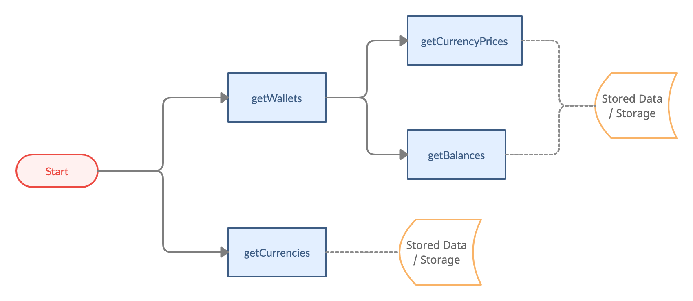
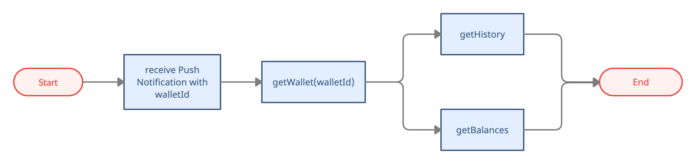
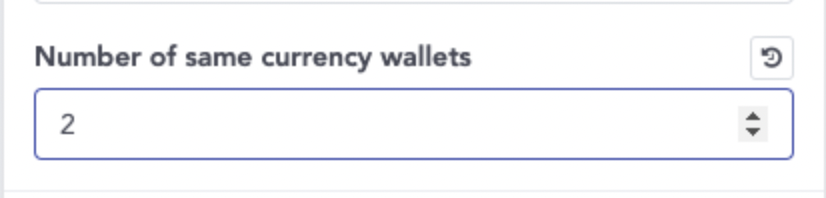

# Wallets

- Bookmarks
  - [Wallet Information](#wallet-information)
  - [Wallet Management](#wallet-management)
  - [Others](#others)

## Wallet Information



### getCurrencies

- Use case 1: when `getWallets`, filter supported currencies for display
- Use case 2: before `createWallet`, call `getCurrencies` + `getSameCurrencyWalletLimit` to decide whether the user can create a new wallet or not.
- For `Currency.currency`, please refer to [Currency Definition](https://github.com/CYBAVO/SOFA_MOCK_SERVER#currency-definition)

```java
/// Get supported currency list
/// - Parameter callback: asynchronous callback
public abstract void getCurrencies(Callback<GetCurrenciesResult> callback);
```

### getWallets

```java
/// Get wallet list of signed in user
/// - Parameter callback: asynchronous callback
public abstract void getWallets(Callback<GetWalletsResult> callback);
```

- Response: List of `Wallet`

  ```java
  public final class Wallet {

    public long walletId; // Wallet ID

    public int type = Type.REGULAR; // REGULAR, MAPPED_WALLET, RELAYER_WALLET

    public String address = ""; // Wallet Address

    public String tokenAddress = ""; // Contract ddress for tokens (ex. ERC-20)

    public String name = ""; // Name of wallet

    public long currency; // Wallet currency ID, refer to Wallets.getCurrencies() API

    public String currencySymbol = ""; // Wallet simple currency name.

    public boolean isPrivate; // Is private chain (CPSC)

    ...
  }
  ```

  - Classify:
    - `TextUtils.isEmpty(tokenAddress) == true` ➜ it is a normal wallet
    - `TextUtils.isEmpty(tokenAddress) == false` ➜ it is a mapped wallet
      - `Currency.tokenVersion == 721 || 1155` ➜ it is an NFT wallet
    - `isPrivate == true` ➜ it is on private chain (CPSC), see [Private Chain](private_chain.md)

### getCurrencyPrices

```java
/// Get Currency price
/// - Parameters:
///   - wallets: array of com.cybavo.wallet.service.wallet.Wallet
///   - exchangeCurrencys: currencies which need to get price. ex usd, twd
///   - approximateRates: rate reference. When the price is 0, it can be calculated by other exchange currency's price multiply the rate. ex ["TWD", ["USD", 29.45]]
///   - callback: asynchronous callback
public abstract void getCurrencyPrice(Wallet[] wallets, String[] exchangeCurrencies, Map<String, Map<String, Double>> approximateRates, Callback<GetCurrencyPriceResult> callback);
```

### getBalances

```java
/// Get number balances on a batch of addresses
/// - Parameters:
///   - addresses: Map of addresses to query. ex: (Wallet.walletId, Wallet)
///   - callback: Contains Map of Balances. ex: (Wallet.walletId, Balance)
public abstract void getBalances(Map<Integer, BalanceAddress> addresses, Callback<GetBalancesResult> callback);
```

- Response: `Balance`

  ```java
  public final class Balance {

      public String balance = "0"; /** Balance */

      public String tokenBalance = "0"; /** Balance of token */

      public String availableBalance = "0"; /** Available balance */

      public String[] tokens = {}; /** Non-Fungible Token IDs for ERC-721*/

      public TokenIdAmount[] tokenIdAmounts = {}; /** Non-Fungible Token ID and amounts for ERC-1155 */

      ...
  }
  ```

  - `Balance` is for the parent wallet (`tokenAddress` is ""). ex: ETH wallet
  - `tokenBalance` is for mapped wallet (`tokenAddress` has value). ex: ERC-20 wallet
  - `availableBalance` provides how much available balance do you have,

    for example :
    1. when you have 1 ETH and you do the tx with 0.2 ETH to send out
    2. the balance will still be 1 ETH until the tx was packed up on blockchain, but the available balance will reduce to 0.8 ETH
    3. that is the customer can only operate the remaining 0.8 ETH

  - if ERC-721 (NFT), use `tokens`
  - if ERC-1155 (NFT), use `tokenIdAmounts`

### getWallet with ID

- used for single wallet refreshing when receiving push-notification



```java
/// Get single wallet information
/// - Parameters:
///   - walletId: Wallet ID to query
///   - callback: asynchronous callback
public abstract void getWallet(long walletId, Callback<GetWalletResult> callback);
```

## Wallet Management

### Create Wallet Flowchart


### createWallet

- make sure to follow the flowchart above to create a wallet
  - `getCurrencies` provides supported currencies
  - `getSameCurrencyWalletLimit` provides the limit wallet count of the same currency
  - `getWallets` provides current user's wallets
  - `TextUtils.isEmpty(tokenAddress) == false` means the currency needs a parent wallet
  - `TextUtils.isEmpty(tokenAddress) == true` means the currency don't need a parent wallet
  - A mapped wallet has same wallet address with its parent wallet.  
  If a wallet address has been used for create a mapped wallet, you cannot create 2 or more mapped wallet with same `currency` and `tokenAddress` to this wallet address. You have to choose another parent wallet.
  - If you're creating a mapped wallet and there is no parent wallet available. You need to create a parent wallet for it.

- For `currency`, please refer to [Currency Definition](https://github.com/CYBAVO/SOFA_MOCK_SERVER#currency-definition)

```java
/// Create a new wallet
/// - Parameters:
///   - currency: Currency of desired new wallet. ex: 60 for ETH
///   - tokenAddress: Token address for tokens, i.e. an ERC-20 token wallet maps to an Ethereum wallet
///   - parentWalletId: Parent wallet for tokens, i.e. an ERC-20 token wallet maps to an Ethereum wallet
///   - name: Name of the new wallet
///   - pinSecret: PIN Secret retrieved via PinCodeInputView
///   - extraAttributes: Extra attributes for specific currencies, pass null if unspecified.
///             Supported extras: account_name (String) - Account name for EOS
///   - callback: asynchronous callback of walletId
public abstract void createWallet(long currency, String tokenAddress, long parentWalletId, String name, PinSecret pinSecret, Map<String, String> extraAttributes, Callback<CreateWalletResult> callback);
```

### getSameCurrencyWalletLimit

- Administrators can configure this value on admin panel.

 

- Before `createWallet`, call `getCurrencies` + `getSameCurrencyWalletLimit` to decide whether the user can create a new wallet or not.

```java
/// Get wallet count limit per currency
/// - Parameters:
///   - callback: wallet count limit of the same currency
public abstract void getSameCurrencyWalletLimit(Callback<GetSameCurrencyWalletLimitResult> callback);
```

### renameWallet

```java
/// Rename an existing wallet
/// - Parameters:
///   - walletId: Wallet ID to rename
///   - name: New name of the wallet
///   - callback: asynchronous callback
public abstract void renameWallet(long walletId, String name, Callback<RenameWalletResult> callback);
```

## Others

### queryCoinType

- Use case:  
    When scanning a wallet address with QR code, use this API to get which currency type it is.

```java
/// Get coin type with address
/// - Parameters:
///   - address: wallet address string
///   - callback: asynchronous callback
public abstract void queryCoinType(String address, Callback<QueryCoinTypeResult> callback);
```

### getMarketInfos

```java
/// Get current top currency infos
/// - Parameter callback: asynchronous callback
public abstract void getMarketInfos(Callback<GetMarketInfosResult> callback);
```
